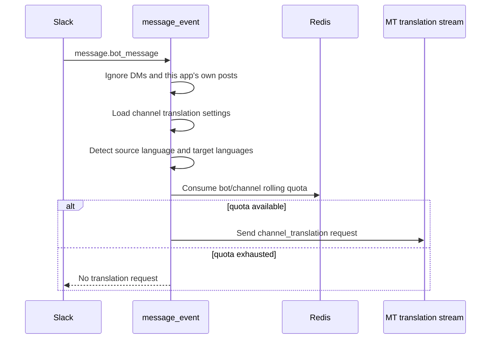

# Bot Message Channel Translation

Slack bot messages can be translated by the existing channel translation pipeline when channel translation is enabled for the channel.

## Flow

## Rate Limit

Bot channel translations are limited to 10 bot messages per bot, per channel, per 5-minute window. The Redis key is scoped by Slack channel ID and Slack `bot_id`.

The quota is consumed once per bot message, regardless of how many channel translation languages are configured. If Redis cannot record the quota, bot translation fails closed and no MT request is sent.
