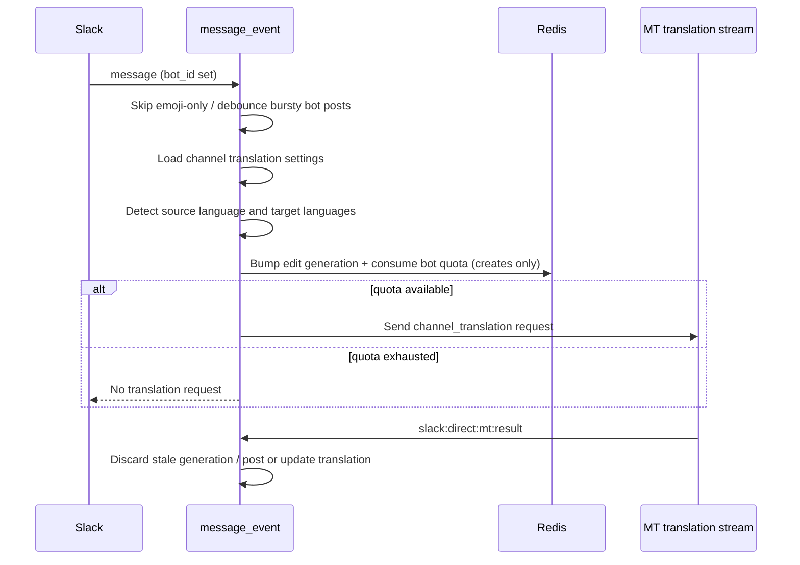

# Bot Message Channel Translation

Slack bot messages can be translated by the existing channel translation pipeline when channel translation is enabled for the channel.

## Flow

## Guards (RAY-80512)

- **Emoji-only messages** — text that is only Slack `:emoji:` tokens (for example `:3dotsloading:`) is not translated.
- **Bot debounce** — new bot posts are debounced per `(channel_id, bot_id)` so streaming bots that emit several messages in quick succession only translate the last payload in the window. Configured via `BOT_TRANSLATION_DEBOUNCE_SECONDS` (default 3s). The debounce is implemented as a deferred SAQ job (`translate_debounced_bot_message`): each bot post overwrites the latest payload in Redis and enqueues a `scheduled` job keyed by `(channel_id, bot_id)`; SAQ's unique-key dedup collapses the burst to one durable job that translates the last stored payload when it fires.
- **Edit generation** — each translate request bumps a Redis generation counter keyed by source `message_ts`. MT callbacks with an older generation are discarded so only the latest edit wins.
- **Edit rate limit exemption** — `message_changed` re-translations do not consume the bot rolling quota.

## Rate Limit

Bot channel translations are limited to 10 **new** bot messages per bot, per channel, per 5-minute window. The Redis key is scoped by Slack channel ID and Slack `bot_id`.

Edits (`message_changed`) are excluded from this quota. The quota is consumed once per debounced bot message, regardless of how many channel translation languages are configured. If Redis cannot record the quota, bot translation fails closed and no MT request is sent.

## Translation reply cache (`mt_ts`)

When a translation is first posted, the bot reply timestamp is written synchronously to Redis (`slack-ray-translator:mt_ts:{source_ts}`) so a subsequent edit can `chat.update` the same reply. Edit-generation discard handles out-of-order MT completions; the synchronous cache write keeps the edit path reliable without waiting on a background worker.

## Reporting Metadata

Bot channel translations carry `is_bot=true` in the MT callback metadata and the `/mt/inline-usage` reporting payload. The Slack poster id uses the bot user id from the message when Slack provides it, while the bot display name from `bot_profile.name` is used as the reporting `client_name` fallback if Slack profile lookup cannot return a human-style profile.
