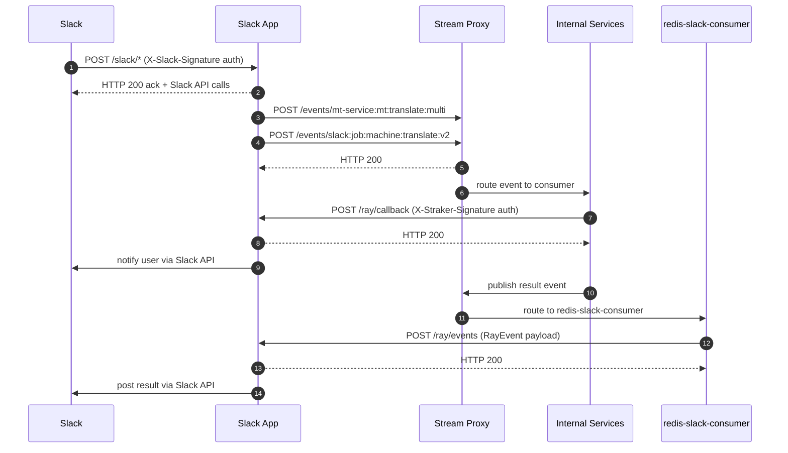

# Communication Boundaries — Sequence Diagram

This document describes the communication boundaries between the Slack App and all internal/external services it interacts with.

> For a detailed catalogue of every endpoint and Redis stream event, see [Internal Services & Redis Stream Events](internal-services.md).

---

## Participants

| Participant | Description |
|---|---|
| **Slack** | Slack's platform — sends authenticated HTTP events, actions, commands to the app |
| **Slack App** | This service slack-straker-translate (`slack-ray-translator` - previous name) — FastAPI + Slack Bolt |
| **Slack API** | Slack's web API — used by the app to post messages, upload files, etc. |
| **Stream Proxy** | Internal event bus — receives published events and routes them to consumers |
| **Internal Services** | RAY platform, MT services, transcription consumers, cloud-verify-consumer, etc. |
| **redis-slack-consumer** | Internal Redis consumer — listens for Slack-specific events and calls back into this app |

---

## Sequence Diagram

---

## Route Summary

### Inbound from Slack
| Route | Method | Purpose |
|---|---|---|
| `/slack/*` | GET / POST | All Slack platform events, actions, commands, shortcuts — handled by Slack Bolt (`app/routers/slack.py`) |

### Inbound from Internal Services
| Route | Method | Purpose |
|---|---|---|
| `/ray/events` | POST | Event results from `redis-slack-consumer` (transcription, translation, embedding, MT, RAY job events) — handled in `app/routers/ray.py` |
| `/ray/callback` | POST | Direct job status callbacks from the RAY platform — signature validated via `X-Straker-Signature` |

### Outbound to External / Internal
| Destination | Transport | Purpose |
|---|---|---|
| **Slack** | HTTPS (Slack SDK) | Post messages, upload files, open modals, ephemeral messages |
| **Stream Proxy** | HTTP POST | Publish MT translation requests, SRT translation jobs, and other processing events |
| **RAY / Internal APIs** | HTTP | Auth lookups, job pricing, evaluation jobs, credit spending |
