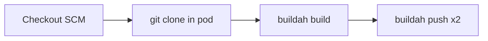

# Container Build Speed

How Jenkins builds the Slack Ray Translator image and what we do to keep cold builds shorter.

## Pipeline

`build.jenkinsfile` runs on a privileged Buildah agent:

1. Clone `$BRANCH` of the app repo
2. `buildah build` (layer cache enabled by default)
3. Push `:tag-latest` and `:tag-$GITTAG`

## Speedups

| Change | Why |
|---|---|
| No default `--no-cache` | Reuse layers when the agent has warm Buildah storage. Force a full rebuild with Jenkins param / env `NO_CACHE=true`. |
| `apt-get install --no-install-recommends ffmpeg` | Runtime only needs ffprobe (`ffmpeg.probe` for media duration). Skipping recommends cuts apt download/unpack size. |
| `rm -rf /var/lib/apt/lists/*` | Keeps the final image smaller (faster push). |

## Notes

- Ephemeral Jenkins pods may still cold-build often if Buildah storage is not persisted on the node. The ffmpeg slim helps every cold build; cache helps when storage is warm.
- Do **not** switch package managers (e.g. uv) without a separate migration — Pipfile remains the source of truth.
