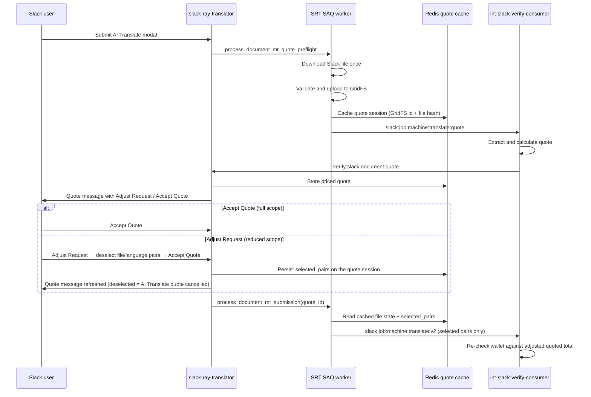

# Document MT Quote Confirmation (RAY-79115)

Document AI Translate now prepares a short-lived quote before submitting the
actual machine-translation job. The first phase is owned by local SAQ work in
`slack-ray-translator`; exact extract/character counting still belongs to
`int-slack-verify-consumer`.

PDF conversion fees are included in the quote total for PDF uploads. Quote
preflight extracts text directly from the PDF (via M48) and counts pages via
Adobe properties only — no DOCX conversion at quote time. When the user accepts,
the full Adobe convert → re-extract → translate pipeline runs; character counts
may differ slightly from the preflight quote.

Slack renders Document MT quotes with the same **Service Quote** layout used for
staged evaluate AI Translation quotes: optional PDF conversion cost first
(page count + fee), then a per-file / per-language AI Translation cost
breakdown, and total cost. Quotes no longer use “estimated” wording or an
aggregate-only total when PDF conversion applies.

The quote message offers the same **Adjust Request** UI as the staged human
verification AI quote: an **Adjust Request** button opens a modal with
independent per-file/per-language checkboxes and a live total, and its submit
button (**Accept Quote**) applies the selection and starts translation for the
adjusted scope only.

## Flow



## Cached Quote Session

Quote state is stored under
`slack-ray-translator:document-mt-quote:{quote_id}` with
`DOCUMENT_MT_QUOTE_TTL_SECONDS` controlling expiry. The default is 12 hours.

The session stores:

- Slack ownership fields: `user_id`, `team_id`, `enterprise_id`, `channel_id`
- Requested languages: `source_language`, `target_languages`
- Cached file state: Slack file id, GridFS `file_id`, file name, file size, and
  SHA-256 content hash
- Consumer quote result: per-file character counts, per-target token/USD
  estimates, total tokens, total USD, and optional `preflight_task_uuid`
- Adjust Request state (optional): `selected_pairs`
  (`<gridfs_file_id>:<target_language>` entries kept by the user) and the quote
  `message_ts` used to refresh the quote message in place

The accept path uses this cached state to avoid downloading the Slack file again
and to create duplicate-submission records from metadata instead of re-reading
the source file.

## Adjust Request

The Adjust Request flow reuses the staged-evaluate AI quote machinery with a
dedicated `quote_kind="document_mt"`:

- `document_mt_quote_blocks` builds per-file/per-language cost rows from the
  consumer quote's `files[].target_languages[]` breakdown and passes
  `adjust_action_id="document_mt_quote_adjust"` to the shared
  `evaluation_credits_quote_blocks` layout. Quotes priced before this change
  (no per-file rows) keep the aggregate layout with Accept only.
- `handle_ai_quote_adjust` maps the action to the `document_mt` quote kind and
  `populate_ai_quote_adjustment_modal` renders
  `evaluation_ai_quote_adjust_modal` straight from the Redis quote session —
  no Verify API call is needed. Language display names come from the MT
  language catalogue (`get_auto_translate_languages`).
- Checkbox toggles refresh the modal total from the SOW charge
  (`ceil(billable_chars × 0.002)` per file via
  `document_mt_tokens_for_pairs`, where billable chars subtract each selected
  target's exact (100%) TM/memory match characters — RAY-81323) and
  redistribute per-row USD labels across
  the selected pairs so lines still sum to Total; PDF conversion fees follow
  files that still have at least one selected pair
  (`document_mt_pdf_tokens_for_pairs`).
- Modal submit persists `selected_pairs` onto the quote session, refreshes the
  quote message keeping the full file/language grid (deselected pairs show
  **AI Translate quote cancelled**, matching the staged AI quote), re-prices
  the total from the selection, then accepts the quote — mirroring the staged
  AI quote, whose modal submit button is **Accept Quote**.
  Deselecting every pair is allowed: the quote message keeps the full grid with
  every row as **AI Translate quote cancelled**, Accept/Adjust actions are
  removed, and acceptance is skipped (the Redis quote session is deleted).

Pair keys use the GridFS `file_id` (not the Slack file id) so the modal, the
quote session, the submission filter, and the consumer funding check all agree
on one identity.

USD amounts always display with two decimal places (`USD 0.02`). Per-target
token rows are individually ceiled, so summing them can exceed the charged AI
total (minimum-token cases). Quote message and Adjust modal line amounts
therefore **distribute** the charged total across active file/language rows
(largest remainder on cents). Charged AI tokens for any Adjust selection are
recomputed with the SOW formula from `character_count` and the selected target
count per file (not by summing ceiled row tokens), minus each selected target's
`memory_matched_characters` (100% TM matches are free — RAY-81323).

## Stream Contract

### Outbound: `slack:job:machine:translate:quote`

Published by `send_document_mt_quote_request`.

```json
{
  "data": {
    "quote_id": "<uuid>",
    "files": [
      {
        "file_id": "<gridfs_id>",
        "file_name": "document.docx",
        "file_size": 12345
      }
    ],
    "client_id": "<member_uuid>",
    "channel_id": "<slack_channel>",
    "source_language": "en",
    "target_languages": ["fr", "de"],
    "ai_engine": "google",
    "data_source": "slack",
    "output_stream": "verify:slack:document:quote"
  },
  "source": "Straker Translate for Slack"
}
```

### Inbound: `verify:slack:document:quote`

Handled by `/ray/events`.

```json
{
  "data": {
    "quote_id": "<uuid>",
    "client_id": "<member_uuid>",
    "channel_id": "<slack_channel>",
    "currency": "USD",
    "total_tokens": 500,
    "total_cost_usd": 1.25,
    "preflight_task_uuid": "<consumer-cache-key>",
    "files": [
      {
        "file_id": "<gridfs_id>",
        "file_name": "document.docx",
        "character_count": 250000,
        "target_languages": [
          {
            "target_language": "fr",
            "tokens": 500,
            "cost_usd": 1.25
          }
        ]
      }
    ]
  },
  "source": "int-slack-verify-consumer"
}
```

For errors, the same event may carry:

```json
{
  "data": {
    "quote_id": "<uuid>",
    "client_id": "<member_uuid>",
    "channel_id": "<slack_channel>",
    "error": true,
    "error_type": "insufficient_balance",
    "error_data": {
      "balance": 10,
      "required": 50
    }
  }
}
```

## Org-billed quotes (no LanguageCloud member)

Quote preflight matches Document MT submit auth (`RAY-80198`):

- Requires a connected workspace **super group**, not a LanguageCloud member.
- When `ray_connection.client` is missing, `client_id` on
  `slack:job:machine:translate:quote` is the org
  `verify_organization_uuid`.
- PDF trial size limits apply only when a member client is present and marked
  trial; org-billed posters skip the trial PDF cap.

If the SAQ worker still gated on a member (`no_ray_client`), Slack would post
“Preparing an AI Translate quote…” and never publish the quote request —
org-billed users stayed stuck on that message.

## Accepted Translation

When the user accepts the quote, SRT publishes the existing
`slack:job:machine:translate:v2` event. The payload can now include:

- `quote_id`
- `preflight_task_uuid`
- `selected_pairs` — the full adjusted scope as `<gridfs_file_id>:<target_language>`
  entries, present on every file request in the batch when the user adjusted
  the quote (absent/`null` for unadjusted quotes)

The consumer should use these fields to reuse preflight extract state when
available. If no consumer cache is present, the existing full extract/translate
path should still work.

`process_document_mt_submission` scopes an adjusted quote to its selection:
per-file target lists are filtered to the selected pairs, files with no
selected pairs are skipped, and only submitted pairs create
duplicate-submission records, so unsubmitted work is never billed. The
consumer additionally narrows its acceptance-time wallet re-check to the
adjusted quoted total (see `docs/document-mt-quote-preflight.md` in
`int-slack-verify-consumer`).
