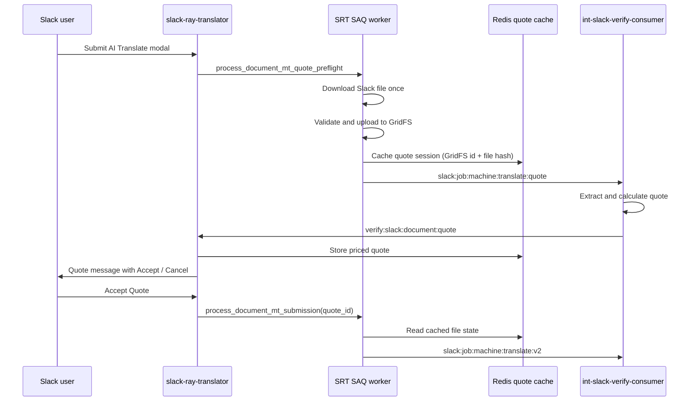

# Document MT Quote Confirmation (RAY-79115)

Document AI Translate now prepares a short-lived quote before submitting the
actual machine-translation job. The first phase is owned by local SAQ work in
`slack-ray-translator`; exact extract/character counting still belongs to
`int-slack-verify-consumer`.

PDF conversion fees are included in the quote total for PDF uploads. Quote
preflight extracts text directly from the PDF (via M48) and counts pages via
Adobe properties only — no DOCX conversion at quote time. When the user accepts,
the full Adobe convert → re-extract → translate pipeline runs; character counts
may differ slightly from the preflight quote.

Slack renders Document MT quotes with the same **Service Quote** layout used for
staged evaluate AI Translation quotes: AI Translation cost, optional PDF
conversion cost (page count + fee), and total cost. Quotes no longer use
“estimated” wording or an aggregate-only total when PDF conversion applies.

## Flow



## Cached Quote Session

Quote state is stored under
`slack-ray-translator:document-mt-quote:{quote_id}` with
`DOCUMENT_MT_QUOTE_TTL_SECONDS` controlling expiry. The default is 12 hours.

The session stores:

- Slack ownership fields: `user_id`, `team_id`, `enterprise_id`, `channel_id`
- Requested languages: `source_language`, `target_languages`
- Cached file state: Slack file id, GridFS `file_id`, file name, file size, and
  SHA-256 content hash
- Consumer quote result: per-file character counts, per-target token/USD
  estimates, total tokens, total USD, and optional `preflight_task_uuid`

The accept path uses this cached state to avoid downloading the Slack file again
and to create duplicate-submission records from metadata instead of re-reading
the source file.

## Stream Contract

### Outbound: `slack:job:machine:translate:quote`

Published by `send_document_mt_quote_request`.

```json
{
  "data": {
    "quote_id": "<uuid>",
    "files": [
      {
        "file_id": "<gridfs_id>",
        "file_name": "document.docx",
        "file_size": 12345
      }
    ],
    "client_id": "<member_uuid>",
    "channel_id": "<slack_channel>",
    "source_language": "en",
    "target_languages": ["fr", "de"],
    "ai_engine": "google",
    "data_source": "slack",
    "output_stream": "verify:slack:document:quote"
  },
  "source": "Straker Translate for Slack"
}
```

### Inbound: `verify:slack:document:quote`

Handled by `/ray/events`.

```json
{
  "data": {
    "quote_id": "<uuid>",
    "client_id": "<member_uuid>",
    "channel_id": "<slack_channel>",
    "currency": "USD",
    "total_tokens": 500,
    "total_cost_usd": 1.25,
    "preflight_task_uuid": "<consumer-cache-key>",
    "files": [
      {
        "file_id": "<gridfs_id>",
        "file_name": "document.docx",
        "character_count": 250000,
        "target_languages": [
          {
            "target_language": "fr",
            "tokens": 500,
            "cost_usd": 1.25
          }
        ]
      }
    ]
  },
  "source": "int-slack-verify-consumer"
}
```

For errors, the same event may carry:

```json
{
  "data": {
    "quote_id": "<uuid>",
    "client_id": "<member_uuid>",
    "channel_id": "<slack_channel>",
    "error": true,
    "error_type": "insufficient_balance",
    "error_data": {
      "balance": 10,
      "required": 50
    }
  }
}
```

## Accepted Translation

When the user accepts the quote, SRT publishes the existing
`slack:job:machine:translate:v2` event. The payload can now include:

- `quote_id`
- `preflight_task_uuid`

The consumer should use these fields to reuse preflight extract state when
available. If no consumer cache is present, the existing full extract/translate
path should still work.
