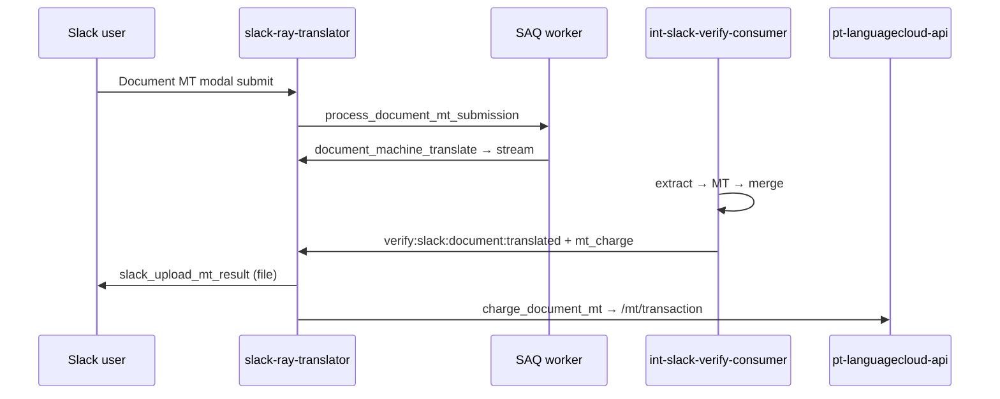

# Document MT without user login — analysis (not HT/QE)

Slack **Document MT** (direct machine translation of uploaded files) is a separate product path from **Quality Evaluation (QE)** and **Human Translation (HT)**. This document compares Document MT to **channel translation** and **shortcut translate**, which already allow org-billed usage without a LanguageCloud user login, and lists what would need to change if Document MT followed the same model.

> **Out of scope:** QE and HT always require a connected LanguageCloud account. They create Verify jobs (`POST /evaluate/create`, `POST /automation/service/create-human-job`) tied to a member identity, quote settings, and workflow context. This doc does **not** propose removing that login requirement.

## Flow comparison

```mermaid
flowchart TB
  subgraph inline["Inline MT — channel / shortcut / DM text"]
    A1[Slack message or shortcut] --> A2{Logged in?}
    A2 -->|No| A3["client_id = org verify_organization_uuid"]
    A2 -->|Yes| A4["client_id = member obj_uuid"]
    A3 --> A5[require_mt_tokens checks org balance]
    A4 --> A5
    A5 --> A6[sup-mt-service translates]
    A6 --> A7["/mt/inline-usage (group token fallback)"]
  end

  subgraph doc["Document MT — today"]
    B1[File action / modal] --> B2{Logged in?}
    B2 -->|No| B3[Login prompt — blocked]
    B2 -->|Yes| B4["client_id = member obj_uuid"]
    B4 --> B5[int-slack-verify-consumer pipeline"]
    B5 --> B6["Balance via member JWT only"]
    B6 --> B7[Deliver file to Slack]
    B7 --> B8["/mt/transaction (member JWT only)"]
  end
```

| Aspect | Channel / shortcut MT | Document MT (today) |
|--------|----------------------|---------------------|
| Login required to submit | No — workspace super group is enough | Yes — `require_ray_client` on modal open and submit |
| Billing principal | Org uuid when poster has no member link | Member uuid only |
| Pre-flight balance check | `get_group_tokens(org_uuid)` via `require_mt_tokens` | Member balance in consumer via `/credits/balance` with member JWT |
| Charge endpoint | `/mt/inline-usage` with `allow_group_fallback=True` | `/mt/transaction` via `log_document_mt_by_client_id` — **no** group fallback |
| Poster on usage report | `email` / `client_name` sent on charge payload | Resolved from `client_uuid` (member) — no poster override today |
| Delivery auth | `get_slack_org` fallback on MT result callback | `get_slack_user(client_id)` only — fails if `client_id` is org uuid |

## Current Document MT login gates

Three layers block org-billed Document MT today:

1. **UI** — `document_mt_job` action and `handle_document_mt_job` call `require_ray_client` (modal cannot open or submit without a linked member).
2. **Submission worker** — `process_document_mt_submission` returns `no_ray_client` when `get_ray_connection` has no member.
3. **Publish** — `document_machine_translate` returns early when `context["ray"].client` is missing; it never substitutes the org uuid into `MtFileRequestSchema.client_id`.

Reference — channel MT org billing pattern:

```1031:1033:app/slack/listener_actions.py
        org_uuid = ray_connection.super_group[0].verify_organization_uuid
        client_id = ray_connection.client.id if ray_connection.client else org_uuid
        group_id = await get_group_id(org_uuid)
```

Reference — Document MT hard requirement on member:

```1124:1126:app/slack/listener_actions.py
    client: RayClient | None = context["ray"].client
    if not file_id or not client:
        return
```

## End-to-end Document MT path (for context)

See [Document MT PDF billing](document-mt-pdf-billing.md) for the deferred charge model. At a high level:



No billing runs inside int-slack-verify-consumer on the Slack path; the consumer **does** gate work on balance before MT starts.

## Can Document MT be org-billed without login?

**Yes** — implemented under **RAY-80198**. Document MT now follows the same org-wallet model as channel/shortcut MT when the poster has no LanguageCloud member link but the Slack workspace has a connected super group.

### Implemented behaviour

| Area | Change |
|------|--------|
| Listeners | `require_ray_client(allow_org_billing=True)` allows submit when `super_group` exists (HT/QE still use member-only default) |
| `document_machine_translate` | Uses org `verify_organization_uuid` as `client_id` when no member; passes `team_id`, `slack_user_id`, `billing_group_uuid` |
| `process_document_mt_submission` | Proceeds without a linked member when the workspace has a super group |
| `resolve_slack_delivery_user` | Delivery/callback auth falls back to `get_slack_org` for org-billed jobs |
| `log_document_mt_by_client_id` | `allow_group_fallback=True` for `/mt/transaction` |
| `slack_upload_mt_result` | Enriches charge with poster `email`/`client_name` and billing `group_uuid` |
| int-slack-verify-consumer | Group-token fallback on balance checks; delivery context on success/error events |

### Original gap analysis (pre-implementation)

#### slack-ray-translator

| Area | Change |
|------|--------|
| Listeners | Drop `require_ray_client` for Document MT open/submit; gate on `super_group` + `require_mt_tokens` (estimated character cost is harder pre-extract — see implications). |
| `process_document_mt_submission` | Allow `ray_connection.client is None`; resolve `client_id = org_uuid`, `group_id` from super group. |
| `document_machine_translate` | Use org uuid as `client_id` when no member; persist `team_id` and `slack_user_id` on `slack_job` for delivery. |
| `slack_upload_mt_result` | When `get_slack_user(client_id)` fails, fall back to `get_slack_org(client_id, team_id)` and target `channel_id` + poster `user_id` (mirror MT result callback auth in `dependencies.py`). |
| `get_ray_event_auth` | Single `resolve_slack_delivery_user` call for inline MT (`extra_data`) and Document MT (root fields) |
| `log_document_mt_by_client_id` | Pass `allow_group_fallback=True` to `_id_token_for_client` (inline MT already does this). |
| `charge_document_mt` / `mt_charge` payload | Send `email`, `client_name`, and billing `group_uuid` on the charge (RAY-80000 parity with inline MT) so IBM usage report shows the poster. |
| Error notifications | Insufficient-balance messages use `get_client_type(member, group)` today — need org-billed branch (admin vs contact-admin messaging). |

#### int-slack-verify-consumer

| Area | Change |
|------|--------|
| `async_get_languagecloud_id_token_from_uuid` | Add org **group token** fallback when `client_uuid` has no `obj_m_member` row (mirror slack-ray `_id_token_for_client`). Without this, `/credits/balance` returns no token and the pipeline fails before extract. |
| Balance checks in `mt_file` / planning | Must authenticate as org/group for org-billed jobs; confirm `/credits/balance` accepts group principals (already true for inline path). |
| Success/error payloads | Optionally carry `team_id` + `slack_user_id` on `MtSuccessResponseSchema` / errors so Ray auth does not depend on member link lookup. |

#### pt-languagecloud-api (verify)

- Confirm `/mt/transaction` accepts group-signed JWTs for `document_translation` and `pdf_conversion_fee` the same way `/mt/inline-usage` does (RAY-80000). Inline path is proven; document path uses a different endpoint and currently calls `_id_token_for_client` without fallback.

#### cloud-verify-api (reporting)

- Org-billed Document MT rows will look like channel MT: `client_uuid == organization_uuid`. Poster identity must come from charge metadata (`email`, `client_name`) — same RAY-80381 / RAY-80380 pattern as channel translation.
- `submission_group_uuid` already uses `slack_job.task_uuid` (RAY-80417) — no report change needed for grouping document MT + PDF fee.

## Implications and risks

### Product / billing

- **Org wallet exposure** — Any workspace member who can attach files and open Document MT could spend org AI tokens without personal login, same as channel auto-translate today. Admins should understand shared balance impact.
- **Pre-submit balance check** — Inline MT checks `len(text) × targets` before sending. Document MT cost is unknown until extract (character count from XLIFF). Options: (a) skip pre-check and fail at planning with `insufficient_balance` (current member path), (b) rough upper bound from file size, or (c) org-only post-extract gate (matches current consumer behavior).
- **PDF conversion fee** — Org-billed Document MT would still defer the combined PDF + document debit until delivery (RAY-80417). Group token must cover both in the balance gate at planning time.
- **Trial limits** — Logged-in trial users get PDF size caps via `ray_client.is_trial`. Org-billed path would need an explicit policy (e.g. no trial cap when billing org, or cap by workspace setting).

### Identity and reporting

- **IBM / SOW usage reports** — Org-billed rows need poster email/name in usage metadata. Channel MT solved this in RAY-80380; Document MT would need the same fields on `/mt/transaction` metadata.
- **slack_job.client_uuid** — Would store org uuid for org-billed jobs; reporting already keys off `task_uuid` / `submission_group_uuid`, not member uuid.

### Delivery and callbacks

- **Critical gap today** — `slack_upload_mt_result` uses `get_slack_user(data.client_id)` only. Org uuid would yield `no_slack_user` and **failed delivery after successful translation** unless delivery auth is extended.
- **Error path auth** — `verify:slack:document:translated` errors use `auth.slack_user` from `get_slack_user(client_id)`; org fallback needed for ephemeral error posts.

### Security / GDPR

- Poster Slack profile email/name would be written to billing metadata (same as channel MT). Ensure logging does not emit raw tokens; existing structured logging rules apply.
- No change to HT/QE RBAC — those flows remain member-authenticated Verify jobs.

### HT/QE remain login-required (intentional)

| Flow | Why login stays required |
|------|-------------------------|
| Quality Evaluation | Verify job creation, file ownership, workflow uuid, trial status |
| Human Translation | Pricing API, PO/reference, linguist job creation |
| New job shortcut (`new_job`) | Routes to QE/HT/document choice — QE/HT buttons still gated |

Document MT is the only file-MT path that could reasonably adopt the channel/shortcut org model.

## Recommendation

Treat org-billed Document MT as a ** deliberate feature** aligned with channel/shortcut MT, not a config flag on the existing member-only path. Minimum viable slice:

1. Extend group-token auth in **both** slack-ray-translator (`log_document_mt_by_client_id`) and int-slack-verify-consumer (balance + any gateway calls).
2. Fix **delivery and callback auth** before changing submit gates (avoid translated files stuck undelivered).
3. Add poster identity + `group_uuid` to document MT charge payload for reporting parity.
4. Add integration tests for: submit without login → pipeline → delivery → single `/mt/transaction` debit against org balance.

## Related docs

- [Document MT PDF billing](document-mt-pdf-billing.md) — deferred `/mt/transaction` charge
- [Bot message channel translation](bot-message-channel-translation.md) — org-billed inline MT reference
- [Internal services](internal-services.md) — stream events and endpoints
- cloud-verify-api [RAY-80000](../cloud-verify-api/docs/ray-80000.md) — spend gateway and usage row contract
- cloud-verify-api [Usage identity backfill RAY-80381](../cloud-verify-api/docs/usage-identity-backfill-ray-80381.md) — org-billed poster identity on reports
