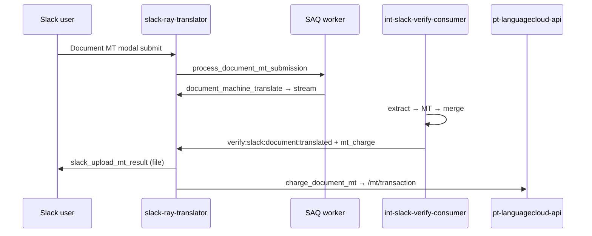

# Document MT / AI Translate org-billed access (not HT/QE)

## Required product contract

| Path | Org / group billing without LanguageCloud member login | Must work |
|------|--------------------------------------------------------|-----------|
| **AI Translate (Document MT)** — modal, quote preflight, Accept Quote, submit | **Yes** — workspace connected `super_group` is enough; bill `verify_organization_uuid` | **Required.** Quote must not stall on “Preparing an AI Translate quote…” |
| Channel / shortcut / DM text MT | **Yes** — same org-wallet model | Required |
| **Human Translation (HT)** | **No** — LanguageCloud member login required | Must keep `require_ray_client(...)` default (no `allow_org_billing`) |
| **Quality Evaluation (QE)** | **No** — member login required | Same as HT |

HT/QE create Verify jobs tied to a member identity (`POST /evaluate/create`, human-job automation). Do **not** enable `allow_org_billing` on those paths.

Document MT / AI Translate is implemented under **RAY-80198** + quote flow **RAY-79115**. SAQ workers (`process_document_mt_quote_preflight`, `process_document_mt_submission`) must use the **super-group** gate (`no_super_group`), not a member-only `no_ray_client` check.

## Flow comparison

```mermaid
flowchart TB
  subgraph inline["Inline MT — channel / shortcut / DM text"]
    A1[Slack message or shortcut] --> A2{Logged in?}
    A2 -->|No| A3["client_id = org verify_organization_uuid"]
    A2 -->|Yes| A4["client_id = member obj_uuid"]
    A3 --> A5[require_mt_tokens checks org balance]
    A4 --> A5
    A5 --> A6[sup-mt-service translates]
    A6 --> A7["/mt/inline-usage (group token fallback)"]
  end

  subgraph doc["Document MT / AI Translate — org-billed"]
    B1[File action / modal] --> B2{Member or super_group?}
    B2 -->|super_group only| B3["client_id = org verify_organization_uuid"]
    B2 -->|member| B4["client_id = member obj_uuid"]
    B3 --> B5[quote preflight SAQ]
    B4 --> B5
    B5 --> B6[Accept Quote → translate:v2]
    B6 --> B7["/mt/transaction group-token fallback"]
  end

  subgraph ht["Human Translation / QE"]
    C1[HT or QE action] --> C2{LC member linked?}
    C2 -->|No| C3[Login required — blocked]
    C2 -->|Yes| C4[Verify evaluate / human job]
  end
```



| Aspect | Channel / shortcut MT | Document MT / AI Translate | HT / QE |
|--------|----------------------|----------------------------|---------|
| Login required | No — super group enough | No — super group enough | **Yes — member required** |
| Billing principal | Org uuid when no member | Org uuid when no member | Member only |
| Quote preflight | N/A (inline) | Org uuid on `translate:quote` | N/A (member Verify quote) |
| Charge endpoint | `/mt/inline-usage` group fallback | `/mt/transaction` group fallback | Verify / automation |

## Delivery failure alerting (RAY-79115)

`slack_upload_mt_result` must page BugLog / Google Chat when Slack delivery fails:

| Outcome | Alert |
|---------|--------|
| `resolve_slack_delivery_user` returns `None` (`no_slack_user`) | Immediate — non-retryable; marks `slack_job` `failed_delivery` and submission `failed` |
| Upload/download error exhausted SAQ retries | On final attempt — same status updates + alert with `task_uuid` / `client_id` / `team_id` / `slack_user_id` |

Silent `failed_delivery` (log only) hid org-billed IBM misses when poster context was missing. Covered by `test_slack_upload_mt_result_no_slack_user_returns_no_user_status` and `test_slack_upload_mt_result_alerts_on_final_delivery_failure`.

## Regression to avoid

If quote SAQ still returns `no_ray_client` when only a super group is linked, Slack posts “Preparing an AI Translate quote…” and never publishes `slack:job:machine:translate:quote`. Covered by `test_process_document_mt_quote_preflight_org_billed_without_member`.

Reference — channel MT org billing pattern:

```1031:1033:app/slack/listener_actions.py
        org_uuid = ray_connection.super_group[0].verify_organization_uuid
        client_id = ray_connection.client.id if ray_connection.client else org_uuid
        group_id = await get_group_id(org_uuid)
```

Document MT publish (`document_machine_translate`) uses the same org-uuid
fallback as channel MT when `ray_connection.client` is missing.

## End-to-end Document MT path (for context)

See [Document MT PDF billing](document-mt-pdf-billing.md) for the deferred charge model. At a high level:



No billing runs inside int-slack-verify-consumer on the Slack path; the consumer **does** gate work on balance before MT starts.

## Can Document MT be org-billed without login?

**Yes** — implemented under **RAY-80198**. Document MT now follows the same org-wallet model as channel/shortcut MT when the poster has no LanguageCloud member link but the Slack workspace has a connected super group.

### Implemented behaviour

| Area | Change |
|------|--------|
| Listeners | `require_ray_client(allow_org_billing=True)` allows submit when `super_group` exists (HT/QE still use member-only default) |
| `document_machine_translate` | Uses org `verify_organization_uuid` as `client_id` when no member; stamps `team_id`, `slack_user_id`, `billing_group_uuid` on `MtFileRequestSchema` / `slack:job:machine:translate:v2` |
| `MtFileRequestSchema` | Carries org-billed delivery fields (`team_id`, `slack_user_id`, `billing_group_uuid`) so verify-consumer can echo them on `document:translated` |
| `process_document_mt_quote_preflight` | Same super-group gate; bills org uuid on `translate:quote` when no member (avoids stuck “Preparing an AI Translate quote…”) |
| `process_document_mt_submission` | Proceeds without a linked member when the workspace has a super group |
| `resolve_slack_delivery_user` | Delivery/callback auth falls back to `get_slack_org` for org-billed jobs; overrides `user_id` with event `slack_user_id` when present |
| `log_document_mt_by_client_id` | `allow_group_fallback=True` for `/mt/transaction` |
| `slack_upload_mt_result` | Enriches charge with poster `email`/`client_name` via `users.info` only when a Slack `U…` id is available; skips org UUID lookups |
| int-slack-verify-consumer | Group-token fallback on balance checks; delivery context on success/error events |

### Original gap analysis (pre-implementation)

#### slack-ray-translator

| Area | Change |
|------|--------|
| Listeners | Drop `require_ray_client` for Document MT open/submit; gate on `super_group` + `require_mt_tokens` (estimated character cost is harder pre-extract — see implications). |
| `process_document_mt_submission` | Allow `ray_connection.client is None`; resolve `client_id = org_uuid`, `group_id` from super group. |
| `document_machine_translate` | Use org uuid as `client_id` when no member; persist `team_id` and `slack_user_id` on `slack_job` for delivery. |
| `slack_upload_mt_result` | When `get_slack_user(client_id)` fails, fall back to `get_slack_org(client_id, team_id)` and target `channel_id` + poster `user_id` (mirror MT result callback auth in `dependencies.py`). |
| `get_ray_event_auth` | Single `resolve_slack_delivery_user` call for inline MT (`extra_data`) and Document MT (root fields) |
| `log_document_mt_by_client_id` | Pass `allow_group_fallback=True` to `_id_token_for_client` (inline MT already does this). |
| `charge_document_mt` / `mt_charge` payload | Send `email`, `client_name`, and billing `group_uuid` on the charge (RAY-80000 parity with inline MT) so IBM usage report shows the poster. |
| Error notifications | Insufficient-balance messages use `get_client_type(member, group)` today — need org-billed branch (admin vs contact-admin messaging). |

#### int-slack-verify-consumer

| Area | Change |
|------|--------|
| `async_get_languagecloud_id_token_from_uuid` | Add org **group token** fallback when `client_uuid` has no `obj_m_member` row (mirror slack-ray `_id_token_for_client`). Without this, `/credits/balance` returns no token and the pipeline fails before extract. |
| Balance checks in `mt_file` / planning | Must authenticate as org/group for org-billed jobs; confirm `/credits/balance` accepts group principals (already true for inline path). |
| Success/error payloads | Optionally carry `team_id` + `slack_user_id` on `MtSuccessResponseSchema` / errors so Ray auth does not depend on member link lookup. |

#### pt-languagecloud-api (verify)

- Confirm `/mt/transaction` accepts group-signed JWTs for `document_translation` and `pdf_conversion_fee` the same way `/mt/inline-usage` does (RAY-80000). Inline path is proven; document path uses a different endpoint and currently calls `_id_token_for_client` without fallback.

#### cloud-verify-api (reporting)

- Org-billed Document MT rows will look like channel MT: `client_uuid == organization_uuid`. Poster identity must come from charge metadata (`email`, `client_name`) — same RAY-80381 / RAY-80380 pattern as channel translation.
- `submission_group_uuid` already uses `slack_job.task_uuid` (RAY-80417) — no report change needed for grouping document MT + PDF fee.

## Implications and risks

### Product / billing

- **Org wallet exposure** — Any workspace member who can attach files and open Document MT could spend org AI tokens without personal login, same as channel auto-translate today. Admins should understand shared balance impact.
- **Pre-submit balance check** — Inline MT checks `len(text) × targets` before sending. Document MT cost is unknown until extract (character count from XLIFF). Options: (a) skip pre-check and fail at planning with `insufficient_balance` (current member path), (b) rough upper bound from file size, or (c) org-only post-extract gate (matches current consumer behavior).
- **PDF conversion fee** — Org-billed Document MT would still defer the combined PDF + document debit until delivery (RAY-80417). Group token must cover both in the balance gate at planning time.
- **Trial limits** — Logged-in trial users get PDF size caps via `ray_client.is_trial`. Org-billed path would need an explicit policy (e.g. no trial cap when billing org, or cap by workspace setting).

### Identity and reporting

- **IBM / SOW usage reports** — Org-billed rows need poster email/name in usage metadata. Channel MT solved this in RAY-80380; Document MT would need the same fields on `/mt/transaction` metadata.
- **slack_job.client_uuid** — Would store org uuid for org-billed jobs; reporting already keys off `task_uuid` / `submission_group_uuid`, not member uuid.

### Delivery and callbacks

- **Critical gap today** — `slack_upload_mt_result` uses `get_slack_user(data.client_id)` only. Org uuid would yield `no_slack_user` and **failed delivery after successful translation** unless delivery auth is extended.
- **Error path auth** — `verify:slack:document:translated` errors use `auth.slack_user` from `get_slack_user(client_id)`; org fallback needed for ephemeral error posts.

### Security / GDPR

- Poster Slack profile email/name would be written to billing metadata (same as channel MT). Ensure logging does not emit raw tokens; existing structured logging rules apply.
- No change to HT/QE RBAC — those flows remain member-authenticated Verify jobs.

### HT/QE remain login-required (intentional)

| Flow | Why login stays required |
|------|-------------------------|
| Quality Evaluation | Verify job creation, file ownership, workflow uuid, trial status |
| Human Translation | Pricing API, PO/reference, linguist job creation |
| New job shortcut (`new_job`) | Routes to QE/HT/document choice — QE/HT buttons still gated |

Document MT is the only file-MT path that could reasonably adopt the channel/shortcut org model.

## Recommendation / status

Org-billed Document MT / AI Translate is **implemented and required** (RAY-80198 + RAY-79115 quote path). Keep HT/QE member-login only. When rebasing quote branches, re-verify SAQ gates still use `no_super_group` — not member-only `no_ray_client`.

## Related docs

- [Document MT PDF billing](document-mt-pdf-billing.md) — deferred `/mt/transaction` charge
- [Bot message channel translation](bot-message-channel-translation.md) — org-billed inline MT reference
- [Internal services](internal-services.md) — stream events and endpoints
- cloud-verify-api [RAY-80000](../cloud-verify-api/docs/ray-80000.md) — spend gateway and usage row contract
- cloud-verify-api [Usage identity backfill RAY-80381](../cloud-verify-api/docs/usage-identity-backfill-ray-80381.md) — org-billed poster identity on reports
