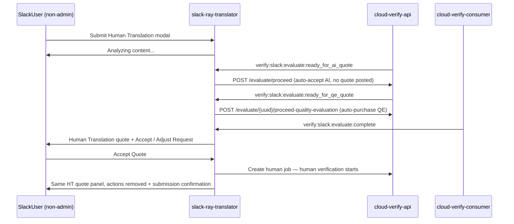
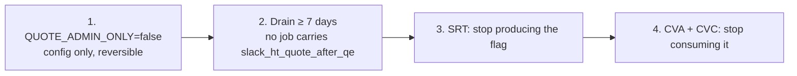
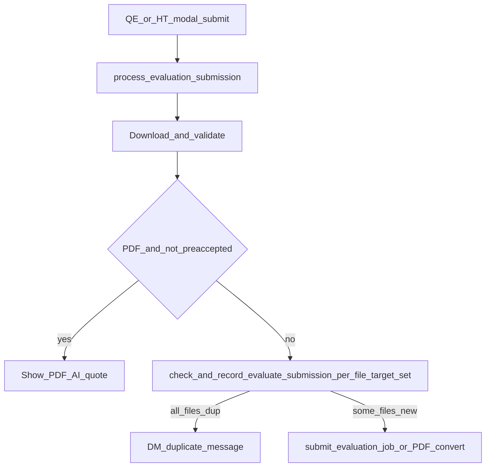
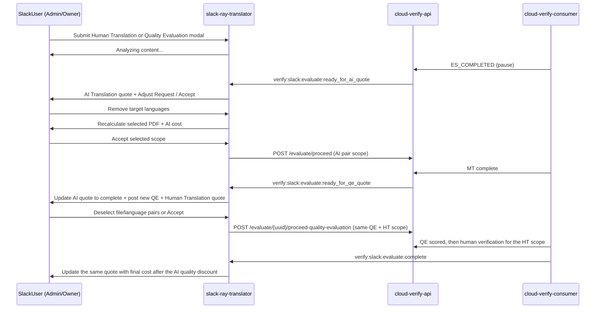

# Evaluate Quote Confirmation (RAY-79115)

Slack Human Translation submissions use a **sequential quote confirmation** flow instead of immediate processing. Slack no longer exposes a standalone post-MT Quality Evaluation quote; after AI Translation, the staged quote combines Quality Evaluation with the Human Translation quote.

## Behaviour

Human Translation (`evaluate_job_human`) submissions:

- Submit without a fixed workflow by default so CVC can build the MT → QE → publish workflow
- Set `confirmation_required=true` on `/evaluate/create`
- Handle staged Slack events and quote accept actions
- Treat `ready_for_qe_quote` as the combined Quality Evaluation + Human Translation quote, not as a standalone QE view

## Admin-only quote UX (`QUOTE_ADMIN_ONLY`)

When `QUOTE_ADMIN_ONLY=true` (default), only Verify group **Admin/Owner** members see Accept/Adjust quote UI. Role comes from `user_may_receive_quotes`: Admin/Owner of the **workspace-linked super group**, or of any active LC group under the workspace Verify org (e.g. “IBM Slack App”). The member’s default group (`obj_m_member.groupid`) is not used. Inactive `mglink` rows and Admin/Owner outside the workspace org do not unlock staged quotes.

| Role | AI | QE | Human Translation |
|------|----|----|-------------------|
| Admin / Owner | Quote → accept | Combined **QE + HT** quote at worst-case QE tier → accept | Included in that combined accept |
| Non-admin | Auto-proceed (no quote) | Auto-purchase QE (no quote) | Separate HT quote after QE; HV only after Accept |
| Non-admin QE modal | Same as prod (`confirmation_required=false`) | Evaluation Result + optional Send for HV | N/A |

Non-admin **Human Translation** clears the fixed `HUMAN_EVALUATION` workflow (it embeds HV too early → empty Adjust / “cancelled” Accept), sets `confirmation_required=true` and `extra_info.slack_ht_quote_after_qe=true`, and lets CVC run synthetic AI+QE **without** an HV node until Slack Accept. HT quotes hide `Quality:` tiers and Adjust is file/language pricing only. Non-admin **Quality Evaluation** stays prod-like (`confirmation_required=false`, no HT-after-QE). PDF pre-quotes are admin-only.

Evaluate submit resolves the member via `get_ray_client` (workspace super-group link is not required). Media non-admin auto-start falls back to posting the Accept quote when balance/login blocks start.

Document MT and Media use the same Admin/Owner gate: admins see quotes; non-admins skip quote UX and auto-start processing.

To lift the restriction, see [Full release plan (lifting admin-only)](#full-release-plan-lifting-admin-only).

## Non-admin Human Translation flow (parity with `master`)

Non-admins see the same Slack message sequence as `master`/prod: submit, then a single Human Translation quote once AI translation and quality evaluation have run, then human verification after Accept. No AI quote and no combined QE + HT quote are posted, and there are no intermediate "AI translation started" / "Quality evaluation is running" status messages.

The Slack messages themselves are format-identical to `master`: the same per-file/per-language price lines, the same `Total Cost` line, and the same "Human translation has been submitted for this language." rows after Accept. `master` never rendered `Quality: best/good` or a `(saved USD X)` suffix — both were added by this branch and are now suppressed on HT quotes, so this is parity, not a change.

Differences are backend-only:

| | `master` / prod | Now |
|---|---|---|
| Workflow on `/evaluate/create` | fixed `HUMAN_EVALUATION` | none — CVC builds synthetic AI + QE, and human verification is created on Accept |
| `confirmation_required` | `false` | `true` for HT; non-admin **Quality Evaluation** stays `false` |

Because non-admin HT jobs no longer carry the fixed HT workflow UUID, any Verify-side display or billing label that keys off `workflow_uuid` will not see it on these jobs. Confirm in UAT before release if HT labelling matters downstream.

## Full release plan (lifting admin-only)

Everything below is the plan for rolling the staged quote flow out beyond Admin/Owner. Until then, non-admins stay on the prod-like HT quote; admins alone see staged AI → combined QE + HT.

### What is admin-only today

| UX / behaviour | Admin / Owner | Non-admin |
|---|---|---|
| Staged AI Translation quote + Accept / Adjust | Yes | No (AI auto-proceeds) |
| Combined QE + HT quote at worst-case tier (`Maximum Total Cost`) | Yes | No |
| Accept helper: “A *discount* will be applied… based on the quality of the AI translation” (`show_accept_discount_helper`) | Yes — pre-QE combined quote only (`PRE_QE_QUOTE_DISPLAY`) | No — standalone HT already has the final price |
| Post-QE in-place update with `Final Cost` + savings | Yes | N/A (no combined quote) |
| PDF evaluate pre-quote | Yes | No (convert/create immediately) |
| Standalone HT quote (`standalone_ht_quote_message`) | Only if a legacy path hits it | Yes — after AI+QE, before HV Accept |
| Document MT / Media quote Accept UI | Yes | No (auto-start) |

The discount helper used to be implied by `actions and not show_savings`. That leaked onto non-admin HT once standalone quotes also hid savings for prod-like totals. It is now an explicit `show_accept_discount_helper` flag, set only in `PRE_QE_QUOTE_DISPLAY`. When the staged flow is opened to everyone, that helper correctly appears on their combined pre-QE quote — do not re-couple it to `show_savings`.

### Release steps

#### 1. The switch

Set `QUOTE_ADMIN_ONLY=false`. `user_may_receive_quotes` then returns true for everyone, so every evaluate submission takes the `may_quote` branch in `process_evaluation_submission`: staged AI quote, combined QE + HT quote (including the discount helper on the pre-QE panel), `confirmation_required=true`, PDF pre-quotes, and no `slack_ht_quote_after_qe` on new jobs. No deploy is needed and flipping it back restores admin-only behaviour.

**The flag is not evaluate-only.** The same gate drives Document MT (`app/slack/handlers/document_mt.py`) and Media (`app/slack/media_quote_actions.py`), so those flows start showing quote UI to everyone at the same moment. To roll evaluate out on its own, add a separate setting rather than widening this one.

#### 2. Drain before deleting

Jobs created while the restriction was on still carry `extra_info.slack_ht_quote_after_qe`, and they need both the SRT standalone HT path and CVC's HV omission to finish correctly. Quote sessions live for `EVALUATE_QUOTE_TTL_SECONDS` (7 days), and CVC parks a staged quote for up to `STAGED_QE_QUOTE_EXPIRY_HOURS` (72h), so wait at least a week after the flip and confirm none are left before removing code. CVC logs the value on every synthetic build (`[V4:SYNTHETIC] ... slack_ht_quote_after_qe=`), which is the easiest thing to search in ELK.

#### 3. SRT — stop producing the flag

| Location | Change |
|---|---|
| `app/saq_jobs/tasks.py` | Collapse the `may_quote` / `is_human_translation` / else branch to the staged defaults (`confirmation_required=True`), drop `is_human_translation` and the `user_may_receive_quotes` call if the setting is retired |
| `app/api/verify.py` | Drop the `slack_ht_quote_after_qe` parameter from `submit_evaluation_job` and `publish_pdf_evaluate_convert` |
| `app/slack/evaluation_submissions.py` | Drop the payload key |
| `app/slack/evaluation_combined_quotes.py` | Drop the flag branch in `post_combined_qe_human_quote` and `_auto_proceed_qe_for_ht_quote_after_qe` |
| `app/ray/events/evaluate_quote_events.py` | Drop the non-admin auto-proceed branch that keys off the flag |
| `app/slack/evaluation_quotes.py` | Drop the flag clauses from `job_is_human_translation_quote` and `quote_snapshot_is_human_translation` |
| `app/constants.py` | Remove `SLACK_HT_QUOTE_AFTER_QE_KEY` last, once nothing references it |

`standalone_ht_quote_message`, `show_accept_discount_helper`, and `PRE_QE_QUOTE_DISPLAY` stay — after the flip, every HT user uses the combined quote path, and the helper remains correct for the pre-QE worst-case estimate.

#### 4. CVA and CVC — stop consuming it

Only after SRT stops sending it:

- **CVA**: the `slack_ht_quote_after_qe` form parameter in `src/evaluate/router.py`, its persistence in `src/evaluate/service.py`, and `tests/evaluate/test_create_evaluation_job_metadata.py::test_create_evaluation_job_persists_slack_ht_quote_after_qe`.
- **CVC**: `defer_hv_to_slack_quote` in `src/workflow/v4/synthetic.py` (`include_human_verification` collapses back to `is_staged_slack_quote_job`), the `extra_info` table row in `docs/staged-evaluate-quote-confirmation.md`, and `tests/workflow/v4/test_synthetic.py::test_staged_slack_ht_quote_after_qe_excludes_human_verification`.

### What stays after cleanup

- **`job_is_human_translation_quote`** — staged quotes still clear `HUMAN_EVALUATION`, so the quote session remains the only durable HT marker. Only its flag clause goes.
- **`standalone_ht_quote_message` and the `evaluate:complete` else-branch** — they also serve jobs whose `workflow_uuid` is `HUMAN_EVALUATION` / `HUMAN_VERIFICATION`. SRT does not create those today, but jobs created outside Slack can still arrive; confirm in ELK before deleting.
- **`QUOTE_ADMIN_ONLY` and `user_may_receive_quotes`** — deleting them removes the only rollback that does not need a deploy. Keep them until the staged flow has been the default for everyone for a full release cycle.
- **`show_quality_discount` / `show_accept_discount_helper`** — keep the helpers. Tiers stay off by default; the Accept discount helper stays on for pre-QE combined quotes only. Remove `_format_quality_discount_text` only if quality tiers are permanently unwanted.

### Verify after the flip

With a non-admin account in UAT:

1. HT submit → **AI quote** (not silence) → Accept → combined QE + HT quote with **Maximum Total Cost** and the discount helper → Accept → post-QE `Final Cost` panel.
2. Plain Quality Evaluation still ends on the Evaluation Result panel.
3. PDF HT submit shows the pre-quote that used to be admin-only.
4. Document MT / Media show quote Accept UI (same gate) unless a separate evaluate-only setting was added.

## Identifying a human translation quote

Both staged paths submit **without** `HUMAN_EVALUATION` so CVC builds a synthetic workflow, so `job_uuid`/`workflow_uuid` cannot tell Slack that a job was quoted as human translation. Deciding rendering from `workflow_uuid` is what caused HT quotes to be replaced by the QE **Evaluation Result** panel (scores + “Send for Human Verification”) after Accept.

`job_is_human_translation_quote` (`app/slack/evaluation_quotes.py`) is the single check, and returns true when any of these hold:

| Signal | Path it covers |
|--------|----------------|
| `workflow_uuid` is `HUMAN_EVALUATION` / `HUMAN_VERIFICATION` | legacy / prod HT jobs |
| `extra_info.slack_ht_quote_after_qe` | non-admin HT-after-QE |
| Quote session snapshot has `auto_submit_human_job`, `slack_ht_quote_after_qe`, or `human_translation_file_and_languages` | admin staged combined QE + HT quote |

It is used by the `verify:slack:evaluate:complete` handler, `submit_verification_job`, `handle_quote_accept_all`, and the Adjust Request submit. The session is stored in Redis for `EVALUATE_QUOTE_TTL_SECONDS` (7 days by default), which outlives the quote → accept window.

Note that the admin staged workflow **does** include an HV node: the combined QE + HT quote is accepted before QE runs, so human verification is meant to start automatically once QE completes. Only the non-admin HT-after-QE path omits HV until Accept.

## Resubmission prevention

QE and HT modal submits use a 24h dedupe gate in `process_evaluation_submission` (`check_and_record_evaluate_submission_async`). Unlike Document MT (per target language), evaluate treats the **full target set** as one unit for simpler grouping:

- Duplicate only when the same user/team/file content/name is submitted again with the **same source and exact same target-language set** (order-independent)
- Overlapping-but-different sets are allowed (e.g. prior `fr+de`, new `fr+es` proceeds as a full new job)
- Hash: `sha256("evaluate:{content}:{source}:{sorted_targets}")` so evaluate rows in `slack_file_translation_submissions` do **not** cross-block Document MT
- QE and HT share that evaluate namespace
- `failed` unlocks retry; `created` / `completed` continue to block within 24h
- Recording runs only on the path that creates work (non-PDF submit, or PDF **after** quote accept). The PDF pre-quote display does not insert rows, so Accept can re-enqueue safely
- All files duplicate: DM the user and skip `/evaluate/create` / PDF convert. Multi-file partial: DM for blocked files and submit only remaining files

## Admin / Owner staged flow

The accept of the combined quote is the only human translation accept: CVC creates the human verification work for the stored HT scope, and SRT only updates the existing quote message. There is no second accept step after QE.

## Slack events

| Event | When |
|-------|------|
| `verify:slack:evaluate:ready_for_ai_quote` | Extract complete, awaiting AI quote accept |
| `verify:slack:evaluate:ready_for_qe_quote` | MT complete, awaiting combined QE + Human Translation quote accept |
| `verify:slack:evaluate:complete` | Full path complete, or `ai_only` when QE skipped |

Published by cloud-verify-api (`src/evaluate/slack_events.py`) via stream proxy.
redis-slack-consumer must subscribe to the new event names.

## cloud-verify-consumer coordination

Separate PR required in **cloud-verify-consumer** — full contract documented in `cloud-verify-api/docs/cvc-evaluate-quote-coordination.md`:

1. Do not auto-proceed Slack jobs with `confirmation_required=true` at `ES_COMPLETED`
2. Call `POST /evaluate/{uuid}/slack/ready-for-ai-quote` when extract completes
3. On proceed with `skip_quality_evaluation` / `mt_only`: run MT, pause before QE, then call `POST /evaluate/{uuid}/slack/ready-for-qe-quote`
4. On `proceed-quality-evaluation` / `qe_only`: resume the deferred workflow into QE scoring
5. Emit `verify:slack:evaluate:complete` with `ai_only=true` when user skips QE quote

## PDF conversion fee

PDF submissions use a pre-job quote so Adobe PDF-to-DOCX conversion is not paid before the user accepts. SRT records each file's PDF page count and derives the AI Translation token cost from Slack file metadata, then shows PDF conversion cost first (25 tokens/page), followed by AI Translation prices grouped by source filename and target language. **Adjust Request** lets the user choose independent file/language pairs; AI cost is recalculated for the selected pairs while PDF conversion cost covers only files that remain in scope. Cost refreshes rewrite checkbox `initial_options` from the live modal state so Slack `views.update` cannot re-select deselected pairs. On accept, SRT forwards `ai_translation_filename_and_languages` (and preaccepted quote metadata) through PDF convert or direct evaluate create — including when the remaining selection is non-PDF only. CVA maps those upload filenames onto `extra_info.ai_translation_file_and_languages` after the files are saved, so MT/QE only process the chosen pairs instead of the full file×language cross-product. int-slack also remaps `.pdf` selections onto the converted `.docx` upload names.

Direct AI Translate (Document MT) quotes use the same Service Quote layout: optional PDF conversion cost first, then AI Translation cost, and total cost. Document MT intro copy states that running AI translation will incur the displayed cost. Staged evaluate (HT) quotes use “AI pre-translation before human review will incur the following cost:” and always show an **AI Translation:** section header beneath PDF conversion so file/language rows are clearly AI costs. Evaluate staged quotes and Document MT quotes no longer use “Estimated” labels or aggregate-only totals when PDF conversion applies.

## Pricing display

Evaluate quote messages display formatted USD costs for all clients. Token counts are still used internally for debit/proceed calls, but Slack no longer renders token-based quote labels such as "Token cost" or "Total tokens".

Only staged AI Translation quotes expose **Adjust Request**; direct AI Translate remains unchanged. The quote groups pricing by source filename and then shows each target language and its pair-specific price, matching the Human Translation quote's layout without showing a completion date. Guidance above the Accept/Adjust actions tells users to review the cost and use Adjust Request to remove languages and/or source files. Language labels are resolved from CVA's Verify language catalogue when the evaluation response contains only UUIDs, including quotes generated by the standalone SAQ worker. The staged modal uses the same file → language-price layout, with file headings read-only and each language rendered as an independent checkbox row beneath its file. Selections are per file/language pair (`file_uuid:language_uuid`); deselecting a language on one file does not change that language on other files. Deselecting every pair submits successfully and cancels the quote (all rows show **AI Translate quote cancelled**, Accept/Adjust actions are removed, and the Redis session moves to `cancelled_ai` so acceptance cannot proceed). The modal shows PDF conversion (when applicable) and **Total cost** only — it does not repeat a separate AI Translation cost line. Opening Adjust Request stores the original quote `channel_id` and `message_ts` in modal private metadata so Accept Quote can update the original Slack message even when the view submission body has no message context. The modal's **Accept Quote** submit action persists that scope and immediately starts the same acceptance flow as the original message button when at least one pair remains; the original quote message is updated in place to remove its actions, keep **Total cost**, show deselected languages as **AI Translate quote cancelled**, and omit any estimated completion date. Extracted jobs use CVA's per-pair quote details for the displayed costs. Acceptance sends the same selected pairs to CVA, preventing the quote display, debit, and processing scope from diverging. Adjustment is rejected once quote acceptance starts.

## Combined QE + Human Translation quote

After the AI Translation quote is accepted and MT completes, SRT updates the original AI quote message to an AI-complete state (status only — no download action; copy: “AI translation is complete. Review the human translation quote below.”) and posts a new Human Translation quote that includes the Quality Evaluation fee, an “Adjust Request” button, and a “Download AI Translations” button for the MT outputs. Subsequent HT accept / post-QE updates target the new message (`message_ts`), while `ai_message_ts` keeps the AI quote reference. The quote is restricted to pairs that completed AI Translation. Adjust Request only offers checkboxes for pairs that have an active cost row, so file-specific language splits do not show the other language at USD 0.00. Deselecting every pair submits successfully and cancels the quote (parity with AI Adjust Request): all rows show **Cancelled**, Accept/Adjust (and Download) are removed, the Redis session moves to `cancelled_qe` so acceptance cannot proceed, and the user gets a short cancellation DM. Pre-QE estimates and the Adjust Request modal label the total as **Maximum Total Cost** and show a short Accept Quote helper line above the action buttons (“Click **Accept Quote** to send your translation for human review. A **discount** will be applied to the quote above based on the quality of the AI translation.”). Quote amounts use a single USD display shape (`USD 40.00`, with a space and no `$` / `US$` / `USD$` variants). Slack uses CVA's per-pair QE quote details and embeds each exact QE fee in its matching Human Translation row instead of evenly distributing an aggregate fee. Deselecting a row therefore removes that pair's exact QE fee and HT price. Because QE has not run yet, SRT requests `/automation/service/pricing` with `assumed_quality_tier=bad` for backend pricing, but the Slack quote **hides** the per-target quality line and aggregate `(saved USD X)` until QE scoring completes. After accept, the quote status reads: “Quote accepted! Submitting for human translation and calculating your final discount based on AI quality...”

When the user accepts this combined quote, SRT purchases QE via `POST /evaluate/{uuid}/proceed-quality-evaluation` and sends the same remaining pair list as both `quality_evaluation_file_and_languages` and `human_translation_file_and_languages`. CVA validates both lists against the AI-translated scope and stores them on the job. CVC evaluates only the QE scope and later creates Human Translation only for the HT scope. SRT does not submit HT after QE; it only updates the Slack quote when the backend workflow reports completion. There is no second user accept step after QE. Accept / Adjust Request submit refreshes keep the full language grid with **Cancelled** rows for deselected pairs (including asymmetric per-file selections) so intermediary “Accepting quote…” panels never show phantom `USD 0.00` lines.

When `verify:slack:evaluate:complete` arrives, SRT validates that refreshed totals include the exact QE charges for the **selected** file/language pairs only, then **updates the original HT/QE quote message in place** with post-QE line amounts, a single Estimated Completion date, and the final-cost status (`Final cost after AI quality evaluation: USD X` plus submission confirmation). No separate follow-up message is posted. The HT quote `message_ts` is taken from the Slack SDK post response when the combined quote is first posted (not only from plain dict responses), and later Redis saves preserve that distinct HT timestamp so complete can `chat.update` instead of reposting. The AI Translation quote message stays in place above with the same per-file/per-language layout (deselected Adjust Request pairs shown as **Cancelled**) and an AI-complete status line.

## Human verification quality discount

`master` renders no quality tiers at all — `quality_discount` does not appear in its `verify_quote_blocks`. The `Quality: good` line and the `(saved USD X)` total suffix were both added here, so both are off by default (`show_quality_discount=False` on `HumanJobQuoteMessage`, `verify_quote_blocks`, `verify_quote_summary_modal` and `combined_human_job_quote_message`); a call site must opt in.

Standalone HT quotes — non-admin submissions and legacy human workflows — go through `standalone_ht_quote_message()`, which pins the prod rendering in one place: no tier, no savings suffix, a plain `Total Cost` label, and **no** Accept discount helper. That last part matters because `verify_quote_blocks` otherwise switches the label to `Maximum Total Cost` whenever savings are hidden, and the Accept helper used to key off the same `show_savings=False` signal. The helper is now `show_accept_discount_helper` (default off); only admin `PRE_QE_QUOTE_DISPLAY` turns it on. The quote posted on `evaluate:complete`, the in-place update on Accept, and the "Submitting quote…" update all use the standalone builder, and the HT Adjust modal passes the same total label.

Prices are unaffected: totals still come from CVA's discounted `estimated_cost` (`/automation/service/pricing`) and recalculate as the user deselects pairs. Only the discount's presentation is suppressed. Combined QE + HT quotes (admin) keep their own display constants — they fold the discount into the line price, show the Accept helper on the pre-QE worst-case panel, and show savings on the post-QE `Final Cost` panel.
