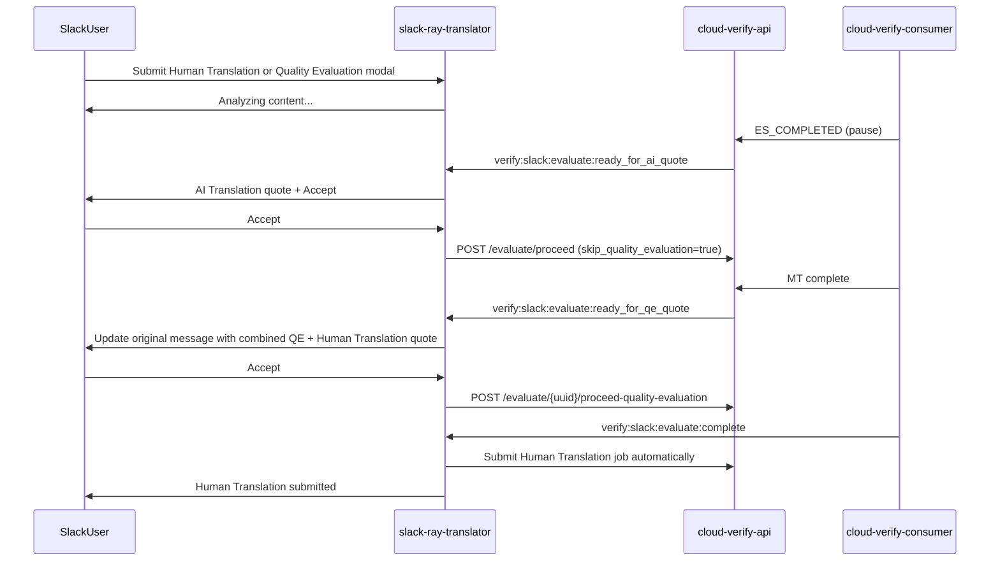

# Evaluate Quote Confirmation (RAY-79115)

Slack Human Translation submissions use a **sequential quote confirmation** flow instead of immediate processing. Slack no longer exposes a standalone post-MT Quality Evaluation quote; after AI Translation, the staged quote combines Quality Evaluation with the Human Translation quote.

## Behaviour

Human Translation (`evaluate_job_human`) submissions:

- Submit without a fixed workflow by default so CVC can build the MT → QE → publish workflow
- Set `confirmation_required=true` on `/evaluate/create`
- Handle staged Slack events and quote accept actions
- Treat `ready_for_qe_quote` as the combined Quality Evaluation + Human Translation quote, not as a standalone QE view

## Flow

## Slack events

| Event | When |
|-------|------|
| `verify:slack:evaluate:ready_for_ai_quote` | Extract complete, awaiting AI quote accept |
| `verify:slack:evaluate:ready_for_qe_quote` | MT complete, awaiting combined QE + Human Translation quote accept |
| `verify:slack:evaluate:complete` | Full path complete, or `ai_only` when QE skipped |

Published by cloud-verify-api (`src/evaluate/slack_events.py`) via stream proxy.
redis-slack-consumer must subscribe to the new event names.

## cloud-verify-consumer coordination

Separate PR required in **cloud-verify-consumer** — full contract documented in `cloud-verify-api/docs/cvc-evaluate-quote-coordination.md`:

1. Do not auto-proceed Slack jobs with `confirmation_required=true` at `ES_COMPLETED`
2. Call `POST /evaluate/{uuid}/slack/ready-for-ai-quote` when extract completes
3. On proceed with `skip_quality_evaluation` / `mt_only`: run MT, pause before QE, then call `POST /evaluate/{uuid}/slack/ready-for-qe-quote`
4. On `proceed-quality-evaluation` / `qe_only`: resume the deferred workflow into QE scoring
5. Emit `verify:slack:evaluate:complete` with `ai_only=true` when user skips QE quote

## PDF conversion fee

PDF submissions use a pre-job quote so Adobe PDF-to-DOCX conversion is not paid before the user accepts. SRT reads PDF page count locally and derives the AI Translation token cost from Slack file metadata, then shows PDF conversion cost first (25 tokens/page), then AI Translation cost. After accept, int-slack-verify-consumer converts the PDF to DOCX, creates the evaluate job with `extra_info.pdf_page_count` and `extra_info.preaccepted_ai_translation_quote`, CVC extracts the DOCX, and SRT auto-proceeds the accurate AI quote before MT starts.

Direct AI Translate (Document MT) quotes use the same Service Quote layout: optional PDF conversion cost first, then AI Translation cost, and total cost. The quote introduction states that running AI translation will incur the displayed cost. Evaluate staged quotes and Document MT quotes no longer use “Estimated” labels or aggregate-only totals when PDF conversion applies.

## Pricing display

Evaluate quote messages display formatted USD costs for all clients. Token counts are still used internally for debit/proceed calls, but Slack no longer renders token-based quote labels such as "Token cost" or "Total tokens".

## Combined QE + Human Translation quote

After the AI Translation quote is accepted and MT completes, SRT replaces the original quote message with a Human Translation quote that also includes the Quality Evaluation fee, an “Adjust Request” button, and a “Download AI Translations” button for the MT outputs. Pre-QE estimates and the Adjust Request modal label the total as **Maximum Total Cost** and show a short Accept Quote helper line above the action buttons. The QE quote is still charged as the aggregate token quote returned by CVA, but Slack embeds that cost in each priced file/language row total instead of showing a separate Quality Evaluation line. In the Adjust Request modal, deselecting a target removes both its Human Translation cost and embedded QE share from the Slack total; submitting the modal stores those selected targets for the later Human Translation submission, while the QE backend purchase remains the aggregate CVA quote. Because QE has not run yet, SRT requests `/automation/service/pricing` with `assumed_quality_tier=bad` for backend pricing, but the Slack quote **hides** the per-target quality line and aggregate `(saved $X)` until QE scoring completes. After accept, the quote status reads: “Quote accepted! Submitting for human translation and calculating your final discount with Arbitr...”

When the user accepts this combined quote, SRT purchases QE via `POST /evaluate/{uuid}/proceed-quality-evaluation` and sends the selected file/language pairs as `human_translation_file_and_languages`. CVA stores those targets on the job, and CVC's staged workflow continues from QE into a backend `human-verification` node that creates the Human Translation job. SRT does not submit HT after QE; it only updates the Slack quote when the backend workflow reports completion. There is no second user accept step after QE.

When `verify:slack:evaluate:complete` arrives, SRT validates that the refreshed totals include the aggregate QE charge for the **selected** file/language pairs only and updates the original quote message with post-QE pricing for those targets. The refreshed panel keeps per-language costs and the estimated completion date, marks deselected rows as `Cancelled`, and removes quality tiers, the duplicate total-cost line, and the AI translation download button because Human Translation is already underway. SRT then posts the authoritative `Final cost after Arbitr evaluation: USD $X (saved $Y)` line when savings are positive, followed by confirmation that the AI translation was submitted to specialist linguists and a pointer to the estimated completion date above. Saved totals are only shown when HT savings exceed the aggregate QE cost allocated to the selected targets.

## Human verification quality discount

When CVA returns `quality_discount` metadata from `/automation/service/pricing`, standalone Human Translation quotes display a compact quality line beneath each price, for example: `USD$45.75` and `Quality: good`. Their quote total uses CVA's final `estimated_cost` sum and shows aggregate savings for the currently selected file/language pairs, recalculating when the user deselects items. Combined QE + Human Translation quotes do not display quality tiers in either the pre-QE or final panel.
