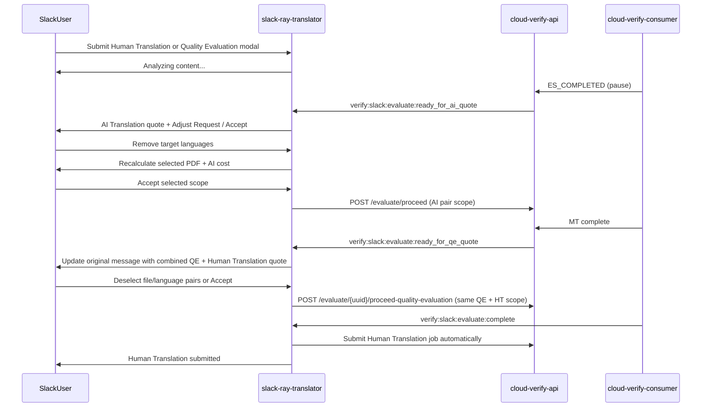

# Evaluate Quote Confirmation (RAY-79115)

Slack Human Translation submissions use a **sequential quote confirmation** flow instead of immediate processing. Slack no longer exposes a standalone post-MT Quality Evaluation quote; after AI Translation, the staged quote combines Quality Evaluation with the Human Translation quote.

## Behaviour

Human Translation (`evaluate_job_human`) submissions:

- Submit without a fixed workflow by default so CVC can build the MT → QE → publish workflow
- Set `confirmation_required=true` on `/evaluate/create`
- Handle staged Slack events and quote accept actions
- Treat `ready_for_qe_quote` as the combined Quality Evaluation + Human Translation quote, not as a standalone QE view

## Flow

## Slack events

| Event | When |
|-------|------|
| `verify:slack:evaluate:ready_for_ai_quote` | Extract complete, awaiting AI quote accept |
| `verify:slack:evaluate:ready_for_qe_quote` | MT complete, awaiting combined QE + Human Translation quote accept |
| `verify:slack:evaluate:complete` | Full path complete, or `ai_only` when QE skipped |

Published by cloud-verify-api (`src/evaluate/slack_events.py`) via stream proxy.
redis-slack-consumer must subscribe to the new event names.

## cloud-verify-consumer coordination

Separate PR required in **cloud-verify-consumer** — full contract documented in `cloud-verify-api/docs/cvc-evaluate-quote-coordination.md`:

1. Do not auto-proceed Slack jobs with `confirmation_required=true` at `ES_COMPLETED`
2. Call `POST /evaluate/{uuid}/slack/ready-for-ai-quote` when extract completes
3. On proceed with `skip_quality_evaluation` / `mt_only`: run MT, pause before QE, then call `POST /evaluate/{uuid}/slack/ready-for-qe-quote`
4. On `proceed-quality-evaluation` / `qe_only`: resume the deferred workflow into QE scoring
5. Emit `verify:slack:evaluate:complete` with `ai_only=true` when user skips QE quote

## PDF conversion fee

PDF submissions use a pre-job quote so Adobe PDF-to-DOCX conversion is not paid before the user accepts. SRT records each file's PDF page count and derives the AI Translation token cost from Slack file metadata, then shows PDF conversion cost first (25 tokens/page), followed by AI Translation prices grouped by source filename and target language. **Adjust Request** lets the user choose independent file/language pairs; AI cost is recalculated for the selected pairs while PDF conversion cost covers only files that remain in scope. Cost refreshes rewrite checkbox `initial_options` from the live modal state so Slack `views.update` cannot re-select deselected pairs. On accept, SRT forwards `ai_translation_filename_and_languages` (and preaccepted quote metadata) through PDF convert or direct evaluate create — including when the remaining selection is non-PDF only. CVA maps those upload filenames onto `extra_info.ai_translation_file_and_languages` after the files are saved, so MT/QE only process the chosen pairs instead of the full file×language cross-product. int-slack also remaps `.pdf` selections onto the converted `.docx` upload names.

Direct AI Translate (Document MT) quotes use the same Service Quote layout: optional PDF conversion cost first, then AI Translation cost, and total cost. The quote introduction states that running AI translation will incur the displayed cost. Evaluate staged quotes and Document MT quotes no longer use “Estimated” labels or aggregate-only totals when PDF conversion applies.

## Pricing display

Evaluate quote messages display formatted USD costs for all clients. Token counts are still used internally for debit/proceed calls, but Slack no longer renders token-based quote labels such as "Token cost" or "Total tokens".

Only staged AI Translation quotes expose **Adjust Request**; direct AI Translate remains unchanged. The quote groups pricing by source filename and then shows each target language and its pair-specific price, matching the Human Translation quote's layout without showing a completion date. Language labels are resolved from CVA's Verify language catalogue when the evaluation response contains only UUIDs, including quotes generated by the standalone SAQ worker. The staged modal uses the same file → language-price layout, with file headings read-only and each language rendered as an independent checkbox row beneath its file. Selections are per file/language pair (`file_uuid:language_uuid`); deselecting a language on one file does not change that language on other files. At least one pair is required. Opening Adjust Request stores the original quote `channel_id` and `message_ts` in modal private metadata so Accept Quote can update the original Slack message even when the view submission body has no message context. The modal's **Accept Quote** submit action persists that scope and immediately starts the same acceptance flow as the original message button; the original quote message is updated in place to remove its actions, keep **Total cost**, show deselected languages as **Cancelled**, and omit any estimated completion date. Extracted jobs use CVA's per-pair quote details for the displayed costs. Acceptance sends the same selected pairs to CVA, preventing the quote display, debit, and processing scope from diverging. Adjustment is rejected once quote acceptance starts.

## Combined QE + Human Translation quote

After the AI Translation quote is accepted and MT completes, SRT replaces the original quote message with a Human Translation quote that also includes the Quality Evaluation fee, an “Adjust Request” button, and a “Download AI Translations” button for the MT outputs. The quote is restricted to pairs that completed AI Translation. Pre-QE estimates and the Adjust Request modal label the total as **Maximum Total Cost** and show a short Accept Quote helper line above the action buttons. Slack uses CVA's per-pair QE quote details and embeds each exact QE fee in its matching Human Translation row instead of evenly distributing an aggregate fee. Deselecting a row therefore removes that pair's exact QE fee and HT price. Because QE has not run yet, SRT requests `/automation/service/pricing` with `assumed_quality_tier=bad` for backend pricing, but the Slack quote **hides** the per-target quality line and aggregate `(saved $X)` until QE scoring completes. After accept, the quote status reads: “Quote accepted! Submitting for human translation and calculating your final discount with Arbitr...”

When the user accepts this combined quote, SRT purchases QE via `POST /evaluate/{uuid}/proceed-quality-evaluation` and sends the same remaining pair list as both `quality_evaluation_file_and_languages` and `human_translation_file_and_languages`. CVA validates both lists against the AI-translated scope and stores them on the job. CVC evaluates only the QE scope and later creates Human Translation only for the HT scope. SRT does not submit HT after QE; it only updates the Slack quote when the backend workflow reports completion. There is no second user accept step after QE.

When `verify:slack:evaluate:complete` arrives, SRT validates that refreshed totals include the exact QE charges for the **selected** file/language pairs only and updates the original quote message with post-QE pricing for those targets. Deselected rows remain visible as **Cancelled**. The refreshed panel keeps per-language costs, and removes quality tiers, the total-cost line, the estimated completion date, and the AI translation download button because Human Translation is already underway. SRT then posts a separate message with `Final cost after Arbitr evaluation: USD $X` (plus savings when positive) and confirmation that the AI translation was submitted to specialist linguists.

## Human verification quality discount

When CVA returns `quality_discount` metadata from `/automation/service/pricing`, standalone Human Translation quotes display a compact quality line beneath each price, for example: `USD$45.75` and `Quality: good`. Their quote total uses CVA's final `estimated_cost` sum and shows aggregate savings for the currently selected file/language pairs, recalculating when the user deselects items. Combined QE + Human Translation quotes do not display quality tiers in either the pre-QE or final panel.
