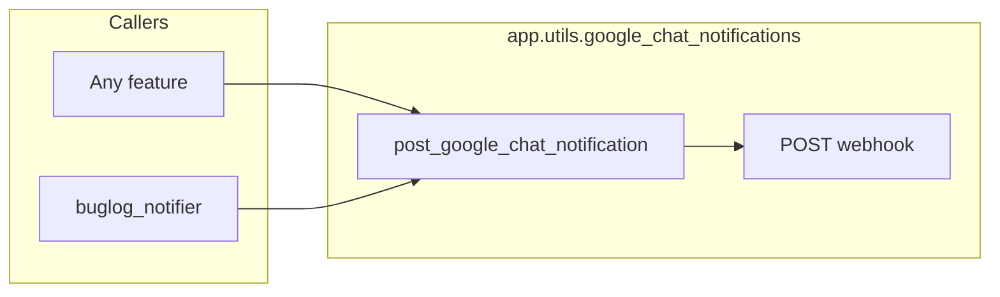

# Google Chat notifications

Operational and dev alerts can be posted to a Google Chat space via an [incoming webhook](https://developers.google.com/chat/how-tos/webhooks). This lives under `app/utils/google_chat_notifications` (cross-cutting utilities). Chat message bodies use neutral headings (`Exception`, `Alert`, `Notice`) with no internal product names.

## Standalone usage

From any code path that already loads app configuration (or in async/sync contexts where scheduling is acceptable):

```python
from app.utils.google_chat_notifications import (
    GoogleChatContext,
    post_google_chat_notification,
)

# Returns immediately; HTTP runs in the background (event-loop task or daemon thread).
post_google_chat_notification(
    msg="Something worth paging about",
    severity="ERROR",
    context=GoogleChatContext.APP,
)

# INFO and other severities are supported; INFO-only messages use a Notice heading.
post_google_chat_notification(
    msg="Deployment finished",
    severity="INFO",
    context=GoogleChatContext.APP,
)
```

Use `exc=...` for exception-shaped payloads (includes traceback). `context=GoogleChatContext.BUGLOG` vs `APP` only marks the call path for future use; visible text is the same.

## Mirroring from `buglog_notifier`

`app.slack.buglog_notifier.notify_exception` sends to BugLog first, then queues Google Chat when **`exc` is not `None` or `msg` contains non-whitespace text** (mirroring does not depend on severity by itself). `notify_message` always calls BugLog, but queues Chat only when **`msg` has non-whitespace content**. Delivery requires `GOOGLE_CHAT_WEBHOOK` to be set (including on `local` if you want dev Chat alerts).

The `bool` return value from those helpers reflects **BugLogHQ only**. Google Chat mirroring is queued **independently** when there is content to mirror (intentional second channel if BugLog fails or rejects).

To send only to Chat and not through `buglog_notifier`, call `post_google_chat_notification` directly.

## Logging and payload sensitivity

On webhook HTTP errors (4xx/5xx), logs record status and response body length only. On transport errors before/during the request, logs record **`transport_error_type`** (exception class name) plus the same **payload** metadata (`exc_type`, `has_msg`, `msg_len`)—not `str(exc)`, not `msg` text, and no traceback for that path—so httpx errors cannot leak the webhook URL from their string form. Full detail remains only in the Chat webhook body when the POST succeeds.

Treat `extra=`, exception messages, and tracebacks as potentially sensitive: avoid tokens, raw Slack payloads, or end-user content in fields that are copied into Chat (and keep call sites aligned with GDPR/data-minimisation policies).

## Diagram


