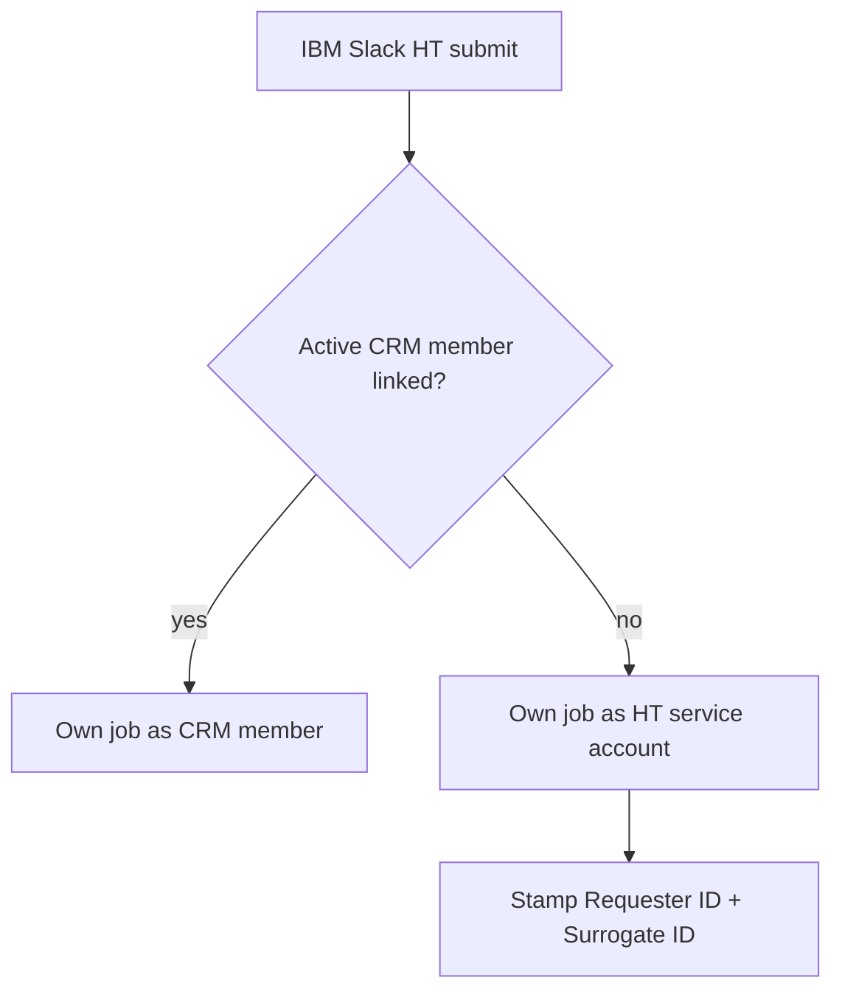

# RAY-81247 — IBM Slack HT reporting-only identity

## Summary

IBM Slack Human Translation jobs prefer an **active CRM member** when the Slack
user already has one. Otherwise the job is owned by a fixed CRM service member
(default: Chris Sacre / `D8CF434C-6FAD-496F-9A6B-C8EE6A0A066B` on IBM Slack App).

When the service account owns the job, the Slack poster is stamped only on
franchise group custom fields:

- **Requester ID** → Slack poster email
- **Surrogate ID** → same email (Lab CAITS pattern)

IBM usage / HT quote reports ignore the service-account `client_uuid` and use
Requester ID (fallback Surrogate ID) for Client Email.

This mirrors existing IBM Lab `api-ibm` jobs (e.g. CAITS Default + Requester/Surrogate
on Sales Order PDFs from `pay.strakertranslations.com`).

## Behaviour

| Path | Owner (`clientid`) | Poster identity |
|------|--------------------|-----------------|
| AI MT (existing) | Verify org UUID | usage metadata email/name |
| IBM Slack HT + active CRM | Poster's CRM member | member email (unchanged) |
| IBM Slack HT + no CRM | HT service account member | Requester/Surrogate custom fields |
| Non-IBM Slack HT | Logged-in LC member | member email (unchanged) |



## Direct Login

Slack **Direct Login** no longer mints CRM People / mglinks. The Direct Login
button is removed from IBM login prompts (home tab and channel). Existing CRM
members can still be linked if an old SSO action is triggered; unknown emails
raise a clear error instead of auto-create.

## Config

```env
HT_SERVICE_ACCOUNT_MEMBER_UUID=D8CF434C-6FAD-496F-9A6B-C8EE6A0A066B
```

IBM Slack App group already defines Requester ID / Surrogate ID custom fields
(`is_quote` / `is_invoice`).

## Code touchpoints

- `app/ibm_ht_service_account.py` — prefer CRM; mint SA JWT; custom-field payload
- Evaluate / quote accept / create-human-job use personal CRM when present
- `cloud-verify-api` create-human-job accepts `custom_fields` and writes
  `obj_tp_job_custom_fields`
- `ibm_ht_quote_export` remaps Client Email when `client_uuid` is the service account
- `pt-languagecloud-api` allows custom_fields for Verify/Slack (not only SwiftBridge)

## Out of scope (follow-ups)

- Dedicated synthetic member (vs Chris Sacre) if finance prefers
- Surrogate ID distinct from Requester if IBM requires it
- Persist poster email on evaluate job so Admin accept stamps original poster
