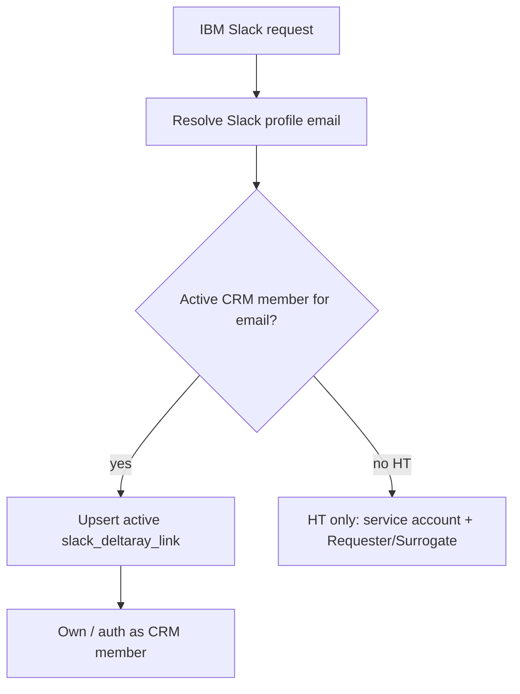

# RAY-81247 — IBM Slack HT reporting-only identity

## Summary

IBM Slack Human Translation jobs prefer an **active CRM member** when the Slack
user already has one. Otherwise the job is owned by a fixed CRM service member
(default: `slackhtjobs@ibm.com` /
`6BB48BEF-1EAD-4824-8724-5298CA10AA86` on IBM Slack App).

When the service account owns the job, the Slack poster is stamped only on
franchise group custom fields:

- **Requester ID** → Slack poster email
- **Surrogate ID** → same email (Lab CAITS pattern)

IBM usage / HT quote reports ignore the service-account `client_uuid` and use
Requester ID (fallback Surrogate ID) for Client Email.

This mirrors existing IBM Lab `api-ibm` jobs (e.g. CAITS Default + Requester/Surrogate
on Sales Order PDFs from `pay.strakertranslations.com`).

## Scope: real IBM customer only

HT service-account ownership and Slack-email→CRM auto-identity apply only when
the Slack enterprise is linked to the **IBM customer** super group
(`9ADE9F44-92A4-4EEE-9BCC-96AFEF9B6D36`, IBM Supergroup 2021).

`is_ibm_enterprise` / `is_ibm_super_group` still treat **Straker Dev** and
sandbox super groups as IBM-like for product UI (hide QE standalone, etc.).
Those workspaces **must still Connect LanguageCloud** and **must not** submit
HT as `slackhtjobs@ibm.com`.

| Classifier | Super groups | HT SA / email auto-resolve | Connect required |
|------------|--------------|----------------------------|------------------|
| `is_ibm_customer_enterprise` | IBM Supergroup 2021 only | yes | HT: no when no CRM; other features: yes if no CRM |
| `is_ibm_enterprise` (IBM-like) | + Straker Dev + sandboxes | no | always (deltaray / Connect) |

On prod, Straker Dev (`13D8D894-…`) is IBM-like for UI but is **not** the IBM
customer super group, so go-live keeps requiring account connection there.

## Behaviour

| Path | Owner (`clientid`) | Poster identity |
|------|--------------------|-----------------|
| AI MT (existing) | Verify org UUID | usage metadata email/name |
| Real IBM + Slack email matches active CRM | That CRM member | member email |
| Real IBM HT + no CRM for email | HT service account member | Requester/Surrogate custom fields |
| Straker Dev / sandbox HT (IBM-like UI) | Logged-in LC member | member email (Connect required) |
| Non-IBM Slack HT | Logged-in LC member | member email (unchanged) |



## Identity (real IBM customer)

Customer-IBM identity does **not** depend on an existing `slack_deltaray_link`.

1. Resolve Slack emails (live `users_info` first, then cached `slack_user_details`)
2. Look up active `obj_m_member` by `login` / `email_primary` for each candidate until one matches
3. If found → build `RayClient` and **upsert** an active deltaray row (insert or reactivate)
4. If not found → `get_ray_client` returns `None`; HT uses the service account

Logout (inactive deltaray) is irrelevant: the next request re-resolves by email.
Stale cached emails (e.g. old `@strakertranslations.com`) must not block a live
Slack profile that matches CRM (e.g. `@strakergroup.com`).

Straker Dev / sandbox skip this path and keep normal deltaray Connect behaviour.

## Direct Login

Slack **Direct Login** no longer mints CRM People / mglinks. The Direct Login
button is removed from IBM login prompts. The old “provisioned by your
administrator” disconnect copy is removed — email→CRM resolve is the path.

## Config

```env
HT_SERVICE_ACCOUNT_MEMBER_UUID=6BB48BEF-1EAD-4824-8724-5298CA10AA86
```

IBM Slack App group already defines Requester ID / Surrogate ID custom fields
(`is_quote` / `is_invoice`). Member is created by flyway
`V20260810_001__RAY-81247-sitemanager-INSERT-ibm-slack-ht-service-account.sql`
(`slackhtjobs@ibm.com`, CRM `Member` + Verify `member` / `role-member`).

## Slack delivery (evaluate / HV)

CVC does **not** look up deltaray. It publishes stream-proxy events with
`client_id` plus poster stamps from `evaluation_jobs.extra_info`
(`slack_user_id`, `slack_team_id`, `slack_channel_id`, `slack_enterprise_id`).

SRT `resolve_slack_delivery_user`:

1. Active `slack_deltaray_link` for `client_id`
2. Else org link when `client_id` is the Verify org UUID
3. Else **workspace stamp fallback**: bot token from `slack_bots` for stamped
   `team_id` / `enterprise_id`, deliver to stamped `slack_user_id`

That covers HT service-account-owned jobs and inactive poster deltaray for
evaluate complete **and** human-verification complete.

Requester/Surrogate remain reporting-only (not delivery).


## Out of scope (follow-ups)

- Surrogate ID distinct from Requester if IBM requires it
- Persist poster email on evaluate job so Admin accept stamps original poster
