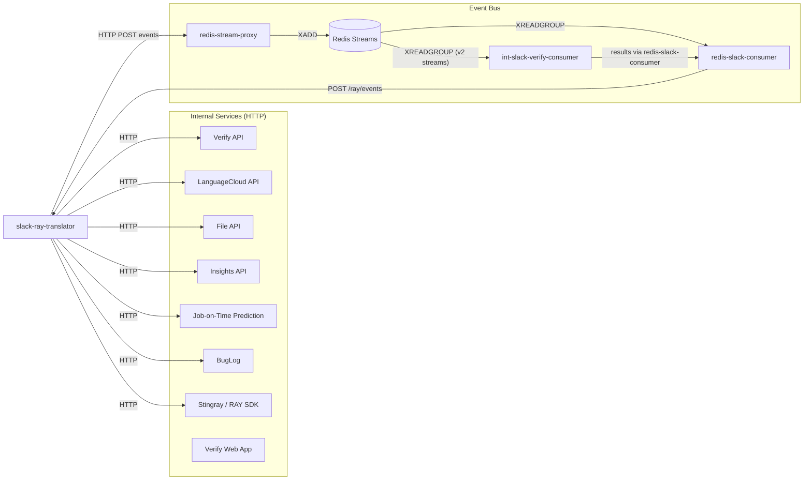

# Internal Services & Redis Stream Events

This document catalogues every internal service that **slack-ray-translator** calls, the HTTP endpoints it uses, and the Redis stream events it dispatches via the Stream Proxy.

> **Note:** This app does not interact with Redis streams directly. All stream events are published as HTTP POST requests to the **redis-stream-proxy** service, which performs the actual `XADD` into Redis.

---

## Architecture Overview




---

## Internal Service Endpoints

### 1. Verify API


| Env Var             | Domain Attribute     |
| ------------------- | -------------------- |
| `VERIFY_API_DOMAIN` | `domains.verify_api` |


Handles quality evaluation jobs, human translation, and language metadata.


| Method | Endpoint                               | Purpose                                                   | Source File         |
| ------ | -------------------------------------- | --------------------------------------------------------- | ------------------- |
| POST   | `/evaluate/create`                     | Create a quality evaluation job with file uploads         | `app/api/verify.py` |
| GET    | `/evaluate/{job_uuid}/files`           | Retrieve evaluation job file list and results             | `app/api/verify.py` |
| GET    | `/files/{file_uuid}`                   | Download a translated/evaluated file by UUID              | `app/api/verify.py` |
| POST   | `/automation/service/create-human-job` | Submit a human translation job for professional linguists | `app/api/verify.py` |
| GET    | `/languages`                           | Get all supported languages (cached in Redis for 1 hour)  | `app/api/verify.py` |
| POST   | `/automation/service/pricing`          | Get pricing/quote for a human translation job             | `app/api/verify.py` |


**Auth:** Bearer token from the user's LanguageCloud JWT (`ray_client.id_token`).

> **Consumer relationship:** Quality evaluation jobs created via `POST /evaluate/create` are processed by **[cloud-verify-consumer](https://github.com/strakergroup/cloud-verify-consumer)**. Results arrive back as `verify:slack:evaluate:complete` and `verify:human_verification:completed` inbound events. For PDF submissions, files are first routed through `slack:evaluate:pdf:convert` → **int-slack-verify-consumer** for PDF→DOCX conversion before the evaluate job is created.

---

### 2. LanguageCloud API


| Env Var                    | Domain Attribute            |
| -------------------------- | --------------------------- |
| `LANGUAGECLOUD_API_DOMAIN` | `domains.languagecloud_api` |


Machine translation engine, language detection, and credit/token management.


| Method | Endpoint           | Purpose                                           | Source File                 |
| ------ | ------------------ | ------------------------------------------------- | --------------------------- |
| POST   | `/mt/detect`       | Detect the language of a given text string        | `app/api/language_cloud.py` |
| GET    | `/credits/balance` | Get the client's AI/MT token balance              | `app/auth/connector.py`     |
| POST   | `/mt/transcribe`   | Log a transcription request and consume AI tokens | `app/auth/connector.py`     |


**Auth:** Bearer token from user JWT or a LanguageCloud group token.

---

### 3. Stream Proxy (Event Bus)


| Env Var               | Domain Attribute       |
| --------------------- | ---------------------- |
| `STREAM_PROXY_DOMAIN` | `domains.stream_proxy` |


Acts as the event bus gateway — accepts HTTP POST requests and publishes them as Redis stream entries. All event dispatching from this app goes through the Stream Proxy.


| Method | Endpoint                | Purpose                                                    | Source File |
| ------ | ----------------------- | ---------------------------------------------------------- | ----------- |
| POST   | `/events/{stream_name}` | Generic event dispatch (all events below use this pattern) | Various     |


See the [Redis Stream Events](#redis-stream-events-dispatched) section below for the specific stream names.

---

### 4. File API


| Env Var           | Domain Attribute   |
| ----------------- | ------------------ |
| `FILE_API_DOMAIN` | `domains.file_api` |


GridFS-backed file storage service for uploading, downloading, and deleting files.


| Method | Endpoint           | Purpose                                                 | Source File        |
| ------ | ------------------ | ------------------------------------------------------- | ------------------ |
| GET    | `/files/{file_id}` | Download a file by ID (streamed to avoid memory issues) | `app/ray/utils.py` |
| DELETE | `/files/{file_id}` | Delete a file from GridFS storage                       | `app/ray/utils.py` |
| PUT    | `/gridfs`          | Upload a file to GridFS, returns the new file ID        | `app/ray/utils.py` |


**Auth:** None (internal service-to-service).

---

### 5. Insights API (depricated)


| Env Var               | Domain Attribute       |
| --------------------- | ---------------------- |
| `INSIGHTS_API_DOMAIN` | `domains.insights_api` |


NLP processing service for natural language prompts and insights. !! This should be removed it is not used or maintianed


| Method | Endpoint | Purpose                                            | Source File                     |
| ------ | -------- | -------------------------------------------------- | ------------------------------- |
| POST   | `/nlp`   | Send a user prompt for NLP analysis (non-blocking) | `app/slack/listener_actions.py` |


**Payload:** `{ "clientId": "<client_id>", "prompt": "<user_text>" }`

---

### 6. Job-on-Time Prediction


| Env Var                         | Domain Attribute                 |
| ------------------------------- | -------------------------------- |
| `JOB_ON_TIME_PREDICTION_DOMAIN` | `domains.job_on_time_prediction` |


ML prediction service for estimating job completion times. Currently disabled in production.


| Method | Endpoint   | Purpose                                    | Source File          |
| ------ | ---------- | ------------------------------------------ | -------------------- |
| POST   | `/predict` | Predict whether jobs will complete on time | `app/ray/service.py` |


**Payload:** `{ "job_ids": ["JOB_ID_1", "JOB_ID_2", ...] }`

---

### 7. Verify Web App


| Env Var         | Domain Attribute |
| --------------- | ---------------- |
| `VERIFY_DOMAIN` | `domains.verify` |


The Verify frontend — used for generating user-facing links (not API calls).


| Method | Endpoint                        | Purpose                                               | Source File                       |
| ------ | ------------------------------- | ----------------------------------------------------- | --------------------------------- |
| POST   | `/integrations?slack_token=...` | Connect a Slack account to LanguageCloud (OAuth flow) | `app/auth/connector.py`           |
| —      | `/`                             | User profile links in Slack messages                  | `app/slack/templates/messages.py` |
| —      | `/settings?tab=usage`           | Link to usage/billing page                            | `app/slack/templates/messages.py` |


---

### 8. Stingray (RAY SDK)


| Env Var           | Domain Attribute   |
| ----------------- | ------------------ |
| `STINGRAY_DOMAIN` | `domains.stingray` |


The RAY platform API — accessed via the `ray_sdk` library, not direct HTTP calls from this app. The SDK handles job management, status queries, and platform operations. Genearlly ray_sdk should be avoided in favour of direct http calls. Generally these are not used anymore

**Initialised in:** `app/ray/service.py` with `domains.stingray` as `base_url` and `domains.languagecloud_api` as `lc_base_url`.

---

### 9. BugLog


| Env Var         | Domain Attribute |
| --------------- | ---------------- |
| `BUGLOG_DOMAIN` | `domains.buglog` |


Centralised error/exception logging service.


| Method | Endpoint                                   | Purpose                              | Source File                    |
| ------ | ------------------------------------------ | ------------------------------------ | ------------------------------ |
| POST   | `/bugLog/listeners/bugLogListenerREST.cfm` | Report exceptions and error messages | `app/config.py`, `app/main.py` |


Configured via the `buglog` library — the app does not make these calls directly.

---

## Shared HTTP Client

All high-frequency internal service calls use a shared `httpx.AsyncClient` with connection pooling, defined in `app/api/http_client.py`:

- **Connection pool:** 100 max connections, 20 keep-alive
- **Timeouts:** connect 10s, read 30s, write 30s, pool 10s
- **Retry:** exponential backoff (1s → 2s → 4s) for `ConnectTimeout`, `ReadTimeout`, and `ConnectError`
- **Max retries:** 3 attempts

---

## Redis Stream Events Dispatched

All events are published via HTTP POST to `{STREAM_PROXY_DOMAIN}/events/{stream_name}`. The Stream Proxy then performs `XADD` to the corresponding Redis stream. Each payload includes `"source": "Straker Translate for Slack"`.

### 1. `mt-service:mt:translate:multi`


| Field             | Value                                                                              |
| ----------------- | ---------------------------------------------------------------------------------- |
| **Purpose**       | Multi-language machine translation of text (direct messages, channel translations) |
| **Trigger**       | User requests text translation via Slack                                           |
| **Consumer**      | **mt-service** (machine translation service)                                       |
| **Output Stream** | `slack:direct:mt:result` (results returned via redis-slack-consumer)               |
| **Source File**   | `app/api/stream_proxy.py`                                                          |


**Payload:**

```json
{
  "data": {
    "app_id": "slack",
    "task_id": "<uuid>",
    "text": ["text to translate"],
    "service_language_mapping": { "google": { "es": "", "fr": "" } },
    "source_language": "en",
    "output_stream": "slack:direct:mt:result",
    "extra_data": { ... }
  }
}
```

---

### 2. `slack:job:machine:translate:v2`


| Field             | Value                                                                                         |
| ----------------- | --------------------------------------------------------------------------------------------- |
| **Purpose**       | File-based machine translation (documents, SRT subtitle files)                                |
| **Trigger**       | User submits a document for MT, or transcribe+translate pipeline triggers SRT translation     |
| **Consumer**      | **[int-slack-verify-consumer](https://github.com/strakergroup/int-slack-verify-consumer)** (file download, extract, translate, merge, upload, credit logging) |
| **Output Stream** | Results via redis-slack-consumer → `POST /ray/events` with `verify:slack:document:translated` |
| **Source Files**  | `app/api/stream_proxy.py`, `app/slack/listener_actions.py`                                    |

> **Note:** This stream uses the `v2` suffix and is consumed by `int-slack-verify-consumer` (forked from `cloud-verify-consumer`). The consumer also handles `teams:job:machine:translate:v2` and `srt:translate:multi:v2` for Teams file MT and SRT subtitle multi-language translation respectively.


**Payload:**

```json
{
  "data": {
    "file_id": "<gridfs_id>",
    "client_id": "<member_uuid>",
    "channel_id": "<slack_channel>",
    "target_language": "es",
    "ai_engine": "google",
    "data_source": "slack",
    "submission_id": 0,
    "task_uuid": "<uuid>"
  }
}
```

---

### 3. `slack:evaluate:pdf:convert`


| Field           | Value                                                                          |
| --------------- | ------------------------------------------------------------------------------ |
| **Purpose**     | Convert PDF files to DOCX before creating a quality evaluation job             |
| **Trigger**     | User submits an evaluate job where at least one file is a `.pdf`               |
| **Consumer**    | **int-slack-verify-consumer** (PDF→DOCX conversion, then creates evaluate job) |
| **Source File** | `app/slack/listeners.py`                                                       |


**Payload:**

```json
{
  "data": {
    "client_uuid": "<uuid>",
    "file_ids": ["<gridfs_id>"],
    "file_names": ["document.pdf"],
    "target_languages_uuid": ["<lang_uuid>"],
    "reference": "Job title",
    "workflow_uuid": "<uuid>",
    "job_notes": "",
    "workflow_version": 3.0,
    "docconverter_version": "m48",
    "channel_id": "<slack_channel>",
    "app_source": "slack"
  }
}
```

---

### 4. `sup-subtitle-ai:media:asr`


| Field             | Value                                                                                  |
| ----------------- | -------------------------------------------------------------------------------------- |
| **Purpose**       | Automatic speech recognition (transcription) for video/audio files                     |
| **Trigger**       | User requests video transcription, transcribe+translate, or transcribe+translate+embed |
| **Consumer**      | **sup-subtitle-ai** (ASR/transcription service)                                        |
| **Output Stream** | `transcription:slack:media:results` (configured in task data as `out_stream_name`)     |
| **Source Files**  | `app/transcriber_tasks/tasks.py`, `app/slack/listeners.py`                             |


**Payload:**

```json
{
  "data": {
    "task_uuid": "<uuid>"
  }
}
```

The full task data (download URL, service, model, output stream, etc.) is stored in the database and referenced by `task_uuid`.

---

### 5. `ray:client:approved`


| Field           | Value                                                                     |
| --------------- | ------------------------------------------------------------------------- |
| **Purpose**     | Notify that an admin has approved a pending client registration           |
| **Trigger**     | Admin clicks "Approve" on a pending client request in Slack               |
| **Consumer**    | **redis-slack-consumer** → routes back to this app via `POST /ray/events` |
| **Source File** | `app/auth/connector.py`                                                   |


**Payload:**

```json
{
  "data": {
    "client_id": "<member_id>",
    "username": "user@example.com",
    "groups": ["group_uuid"],
    "approver": { "client_id": "<admin_id>" }
  }
}
```

---

### 6. Generic `wb_tasks` Events


| Field           | Value                                                          |
| --------------- | -------------------------------------------------------------- |
| **Purpose**     | Dispatch background processing tasks with completion callbacks |
| **Trigger**     | `create_task()` in `app/wb_tasks/tasks.py`                     |
| **Consumer**    | **wb-task-consumer**                                           |
| **Source File** | `app/wb_tasks/tasks.py`                                        |


The stream name and callback are dynamic — passed as parameters to `create_task(member_uuid, event_name, callback_name, task_data)`.

---

## Inbound Events (Consumed by This App)

These events arrive via `POST /ray/events` from **redis-slack-consumer**, which reads them from Redis streams and forwards them as HTTP callbacks.


| Event                                             | Source Service        | Description                                                     |
| ------------------------------------------------- | --------------------- | --------------------------------------------------------------- |
| `ray:slack:account_connected`                     | RAY Platform          | User successfully connected their Slack ↔ LanguageCloud account |
| `ray:client:signup`                               | RAY Platform          | New client signed up on the RAY platform                        |
| `ray:client:approved`                             | redis-slack-consumer  | Client approved by admin (loops back from our own dispatch)     |
| `ray:job:status_changed`                          | RAY Platform          | Job status updated (LEAD, IN_PROGRESS, COMPLETED, etc.)         |
| `ray:job:quote_created`                           | RAY Platform          | New job quote is available                                      |
| `ray:job:quote_accepted`                          | RAY Platform          | Quote accepted by client                                        |
| `ray:job:quote_cancelled`                         | RAY Platform          | Quote cancelled                                                 |
| `transcription:slack:media:transcription:results` | sup-subtitle-ai       | Media transcription (ASR) complete                              |
| `transcription:slack:media:translation:results`   | int-slack-verify-consumer | SRT subtitle translation complete                               |
| `transcription:slack:media:embedding:results`     | sup-subtitle-ai       | Subtitle embedding into video complete                          |
| `verify:slack:document:translated`                | int-slack-verify-consumer | Document machine translation complete (success or error)        |
| `verify:slack:evaluate:complete`                  | Verify API            | Quality evaluation job complete                                 |
| `verify:human_verification:completed`             | Verify API            | Human verification/translation job complete                     |
| `slack:direct:mt:result`                          | mt-service            | Direct/channel text MT translation result                       |


---

## Environment Variables Summary

All service domains are loaded via `StrakerDomains.from_environment()` from `straker_utils`.


| Environment Variable            | Service                       | Domain Attribute                 |
| ------------------------------- | ----------------------------- | -------------------------------- |
| `VERIFY_API_DOMAIN`             | Verify API                    | `domains.verify_api`             |
| `LANGUAGECLOUD_API_DOMAIN`      | LanguageCloud API             | `domains.languagecloud_api`      |
| `STREAM_PROXY_DOMAIN`           | redis-stream-proxy            | `domains.stream_proxy`           |
| `FILE_API_DOMAIN`               | File API (GridFS)             | `domains.file_api`               |
| `INSIGHTS_API_DOMAIN`           | Insights API                  | `domains.insights_api`           |
| `JOB_ON_TIME_PREDICTION_DOMAIN` | Job-on-Time Prediction        | `domains.job_on_time_prediction` |
| `VERIFY_DOMAIN`                 | Verify Web App                | `domains.verify`                 |
| `STINGRAY_DOMAIN`               | Stingray / RAY SDK            | `domains.stingray`               |
| `BUGLOG_DOMAIN`                 | BugLog                        | `domains.buglog`                 |
| `LANGUAGECLOUD_DOMAIN`          | LanguageCloud UI (links only) | `domains.languagecloud`          |
| `SLACK_RAY_TRANSLATOR_DOMAIN`   | This app (self-reference)     | `domains.slack_ray_translator`   |
