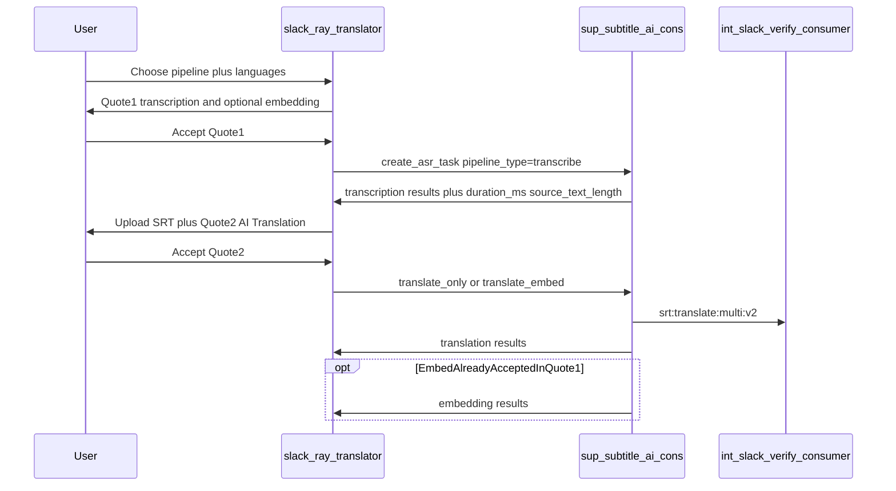

# Media Quote Confirmation

Media transcription, embedding, and AI translation now require explicit Accept
on Service Quote messages before work starts (or continues).

## Product model

| Stage | When quoted | Basis |
|---|---|---|
| Transcription | Before work (Quote1) | Slack `duration_ms` → `duration_to_tokens` (~100 tokens/min) |
| Embedding | Before work (Quote1) | `duration_ms` × target langs → `duration_to_subtitling_tokens` (~30 tokens/min/lang) |
| AI Translation | After transcription (Quote2) | Actual SRT `source_text_length` × targets (`ceil(chars × targets × 0.002)`) |

## Button mapping

- **Transcribe only** → Quote1 (transcription) → ASR → done
- **Transcribe & AI Translate** → Quote1 (transcription) → ASR → Quote2 (translation) → MT
- **Embed Subtitles** (full) → Quote1 (transcription + embedding) → ASR → Quote2 (translation) → MT → embed
- **Embed existing SRT** (thread) → Quote1 (embedding only) posted on SRT upload → embed

Embedding for the full path is accepted in Quote1; there is no third quote after MT.

When a user posts an edited SRT into a media thread, SRT posts the embed-only
Service Quote immediately (no intermediate “Embed Subtitles” CTA). Accept still
gates balance and starts the embed job.

After transcription completes, the source SRT is uploaded without AI-translation
or reupload copy. That guidance is posted only after AI translation files are
delivered.

## Flow

## Redis session

Key: `slack-ray-translator:media-quote:{quote_id}`

TTL: `MEDIA_QUOTE_TTL_SECONDS` (default 43200 = 12 hours).

Session fields include ownership, `pipeline_kind`, file metadata + `duration_ms`,
target languages, stage, priced `line_items`, `task_uuid`, and Slack message ts.

Stages:

- `awaiting_transcription_accept`
- `transcribing` / `embedding`
- `awaiting_translation_accept`
- `translating`
- `done` / `cancelled`

## Consumer phase split (`sup-subtitle-ai-cons`)

Quoted flows create the first job as `pipeline_type=transcribe` even when the
user chose translate or full embed. Legacy `transcribe_translate` /
`transcribe_translate_embed` values also run ASR only (no auto-chain).

After Quote2 accept, SRT updates the DB row and re-triggers
`sup-subtitle-ai:media:asr` with:

- `translate_only` — MT from existing `result_file_id`
- `translate_embed` — MT then embed (embedding already accepted in Quote1)

## Display

Service Quote line items and totals always show **USD** (`tokens × $0.02`),
including IBM workspaces (no token-count display on media quotes).

## Balance gate

Accept handlers check AI token balance against the quote’s priced token total
(not character→token conversion). Spend still happens on stage completion
callbacks (`spend_transcription_credits` / MT consumer / `spend_embedding_credits`).

## Actions

- `media_quote_accept` / `media_quote_cancel` — Quote1
- `media_translation_quote_accept` / `media_translation_quote_cancel` — Quote2
