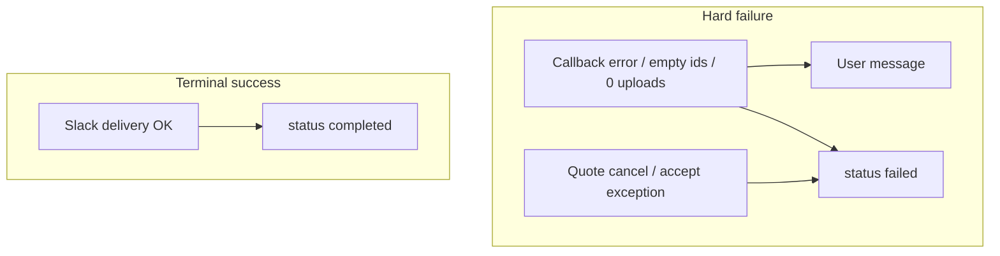

# Media submission status lifecycle (RAY-79115)

Media rows in `ray_integration.slack_file_translation_submissions` use `created` / `completed` / `failed`. This doc describes when slack-ray-translator updates those statuses so 24h dedupe and user messaging stay aligned with Document MT.

## Contract

| Outcome | User message | Status |
|---------|--------------|--------|
| Pipeline callback `error` (transcription / translation / embedding) | Ephemeral via `format_callback_error` | `failed` |
| Translation results with empty `translated_file_ids` | Ephemeral (“no output files”) | `failed` |
| Translate delivery uploaded 0 files | Thread failure already posted | `failed` |
| Embed missing `result_file_id` or upload failure | Thread failure | `failed` (never `completed`) |
| Quote cancel or accept-path exception | Cancel UI / DM | `failed` (unlocks retry) |
| Terminal delivery success (≥1 translated file, or embed upload OK) | Success thread copy | `completed` |
| Transcription-only success (no Quote2) | SRT upload path | `completed` |
| Transcription success then Quote2 posted | Quote2 message | stays `created` until translate/embed terminal |

Spend helpers still run only after a successful stage delivery path (same as before).

## Helpers

- `fail_media_submissions(extra_data)` — resolves `submission_id` and/or `submission_ids` (list or dict values) → `FAILED`
- `update_submission_status(extra_data, processing_status=COMPLETED)` — shared updater used for both complete and fail

## Upstream dependency

For Quote2 `translate_only`, `sup-subtitle-ai-cons` must publish `transcription:slack:media:translation:results` with `error` when every language fails (see that repo’s `docs/media-translate-only-error-forward.md`). Ray also hardens empty-id success events.

## Related

- [Media translation empty upload](media-translation-empty-upload.md) — success copy only after Slack delivery
- [Media Quote Confirmation](media-quote-confirmation.md) — Quote1 / Quote2 accept flow
