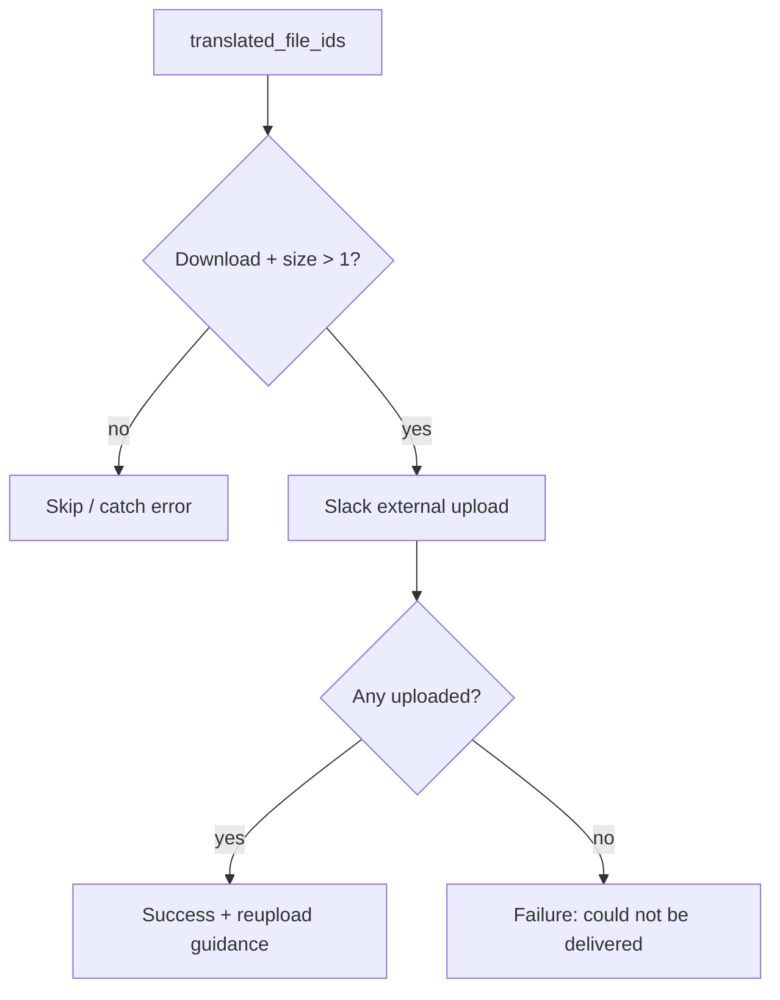

# Media translation empty Slack upload (RAY-79115)

## Symptom

Media AI-translate posted “Your file is AI translated and can be downloaded below” even when no file appeared. Slack `files.getUploadURLExternal` failed with `length must be greater than 1` for a 0-byte SRT.

## Fix

1. `upload_file_to_slack_memory_efficient` refuses files with size ≤ 1 before calling Slack.
2. `handle_translation_complete` uploads first, then posts success/reupload guidance only if at least one file delivered; otherwise posts a delivery-failure message.

Upstream empty SRTs (M48 Hebrew merge) are fixed in `int-slack-verify-consumer` — see that repo’s `docs/hebrew-srt-empty-merge.md`.

