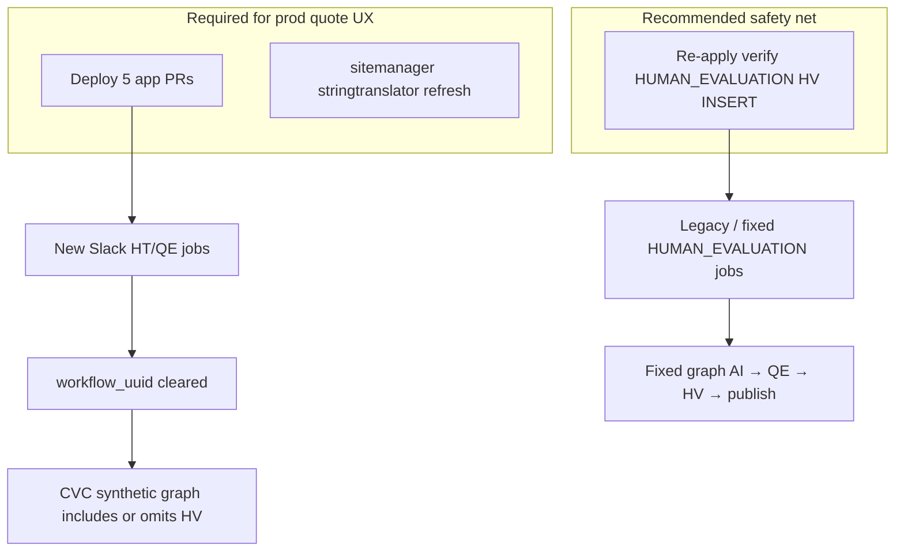

# RAY-79115 Deployment Guide — Quote Confirmation

How to put the staged Slack quote changes live: services, database, order, and
what is actually required vs optional.

## Verdict: which DB changes are required?

| Change | Database | Required for new quote flow? | Current state |
|--------|----------|------------------------------|---------------|
| Re-apply HV node on Slack `HUMAN_EVALUATION` workflow | `verify` (ai-cloud) | **Recommended safety net**, not the primary path | **Prod: reverted** (AI→QE→publish). **UAT: already has HV** |
| Slack UI string refresh (`obj_stringtranslator`) | `sitemanager` (portal) | **Yes** for non-English Slack locales | **Prod: missing**. **UAT: present** |
| Schema ALTERs / new tables for quoting | — | **None** | N/A — quote state uses existing `extra_info` JSON + Redis |



### Why the workflow INSERT is not the primary path anymore

Originally, Slack Human Translation submitted the fixed workflow
`069cfa54-609b-46d3-830b-575168f4ef19` (`HUMAN_EVALUATION`). That graph was only
AI → QE → publish, so staged HT acceptance never created a TP human-verification
job. The INSERT added node-3 `human-verification`.

The quoting PRs changed SRT so HT submissions **clear** that workflow:

```1293:1295:app/saq_jobs/tasks.py
        # Clear HUMAN_EVALUATION for any staged HT path (admin quotes or
        # non-admin HT-after-QE) so CVC builds synthetic AI+QE without early HV.
        submit_workflow_uuid = None if is_human_translation else workflow_uuid
```

CVC then builds a **synthetic** workflow per job:

| Path | Synthetic graph |
|------|-----------------|
| Admin staged (`confirmation_required`, no `slack_ht_quote_after_qe`) | AI → QE → **HV** → publish |
| Non-admin HT-after-QE (`slack_ht_quote_after_qe=true`) | AI → QE → publish (HV created later from Slack Accept) |

So the fixed-workflow INSERT is **not what makes new quote jobs work**. Synthetic
workflows do.

### Why re-apply the INSERT anyway

1. **Prod still uses the fixed workflow today.** Last 30 days of Slack evaluate
   jobs on live-ai-cloud: **47 / 47** had `workflow_uuid = HUMAN_EVALUATION`.
   Until SRT is deployed, those jobs still need the HV node (or they finish
   after QE with no TP job).
2. **Deploy window / rollback.** If CVC/CVA go out before SRT, or SRT is rolled
   back, jobs can still land on the fixed UUID.
3. **UAT parity.** UAT already has the HV node; prod does not (revert was applied).

**Do not run the REVERT again** as part of this release.

---

## Database changes in detail

### 1. `verify` — re-apply HUMAN_EVALUATION HV node (recommended)

**File (same as original INSERT):**

- Downloads: `V20260717_001__RAY-79115-verify-INSERT-workflow_v3_node-edge-human-verification (1).sql`
- Repo: `uat-flyway-migrations/sql/ai-cloud/V20260717_001__RAY-79115-verify-INSERT-workflow_v3_node-edge-human-verification.sql`

**Target:** `live-ai-cloud` / `verify`
**Workflow:** `069cfa54-609b-46d3-830b-575168f4ef19`

**Desired end state:**

| node_id | node_type |
|---------|-----------|
| node-1 | ai-translation |
| node-2 | quality-evaluation |
| node-3 | human-verification (`56ffdabe-77a6-4a5f-bbaf-ec75bbabb407`) |
| node-4 | publish-content (`b93f7c26-9888-43a5-a49b-9fa0852ab983`) |

Edges: `node-1→node-2`, `node-2→node-3`, `node-3→node-4`.

#### Pre-check (prod — expect reverted shape)

```sql
USE verify;

SELECT node_id, node_type, obj_uuid
FROM workflow_v3_node
WHERE workflow_uuid = '069cfa54-609b-46d3-830b-575168f4ef19'
ORDER BY node_id;

SELECT edge_id, source_node_id, target_node_id, obj_uuid
FROM workflow_v3_edge
WHERE workflow_uuid = '069cfa54-609b-46d3-830b-575168f4ef19'
ORDER BY edge_id;
```

Expect **no** `human-verification` row and publish as `node-3`.

#### Apply

Run the INSERT SQL against prod `verify` (same script as UAT). It is **not**
idempotent: if someone already re-applied it, the `INSERT` of
`56ffdabe-…` / `62c51a1b-…` will fail. Always pre-check first.

#### Post-check

```sql
SELECT COUNT(*) AS hv_nodes
FROM workflow_v3_node
WHERE workflow_uuid = '069cfa54-609b-46d3-830b-575168f4ef19'
  AND node_type = 'human-verification';
-- expect 1

SELECT node_id, node_type FROM workflow_v3_node
WHERE workflow_uuid = '069cfa54-609b-46d3-830b-575168f4ef19'
ORDER BY node_id;
-- expect node-1..4 as above
```

#### Rollback (only if release is aborted and apps rolled back)

Use the REVERT script:

`V20260717_001__RAY-79115-verify-REVERT-workflow_v3_node-edge-human-verification.sql`

Do **not** revert if the new SRT/CVC quote code remains live.

---

### 2. `sitemanager` — Slack UI translations (required for locales)

**File:**

`uat-flyway-migrations/sql/pt/V20260729_001__RAY-79115-sitemanager-REFRESH-obj_stringtranslator-slack-ui-translations.sql`

**Target:** `live-portal` / `sitemanager`
**What:** refresh-safe `DELETE` + `INSERT` of quote/UI strings for
`de`, `es`, `fr`, `fr-ca`, `jp` (TJ1675507 vendor return).

Without this, English still works; non-English Slack workspaces fall back to
English labels for new quote copy (`Service Quote`, `Maximum Total Cost`,
Accept helpers, cancel strings, etc.).

#### Pre-check

```sql
SELECT lang, COUNT(*) AS c
FROM sitemanager.obj_stringtranslator
WHERE label IN (
  'Service Quote',
  'Maximum Total Cost',
  'AI Translate quote cancelled.',
  'Quality Evaluation + Human Translation'
)
GROUP BY lang
ORDER BY lang;
```

Prod today: **no rows**. UAT: 4 labels × 5 langs.

#### Apply / post-check

Run the refresh SQL, then re-run the pre-check — expect `c = 4` for each of
`de`, `es`, `fr`, `fr-ca`, `jp`.

---

## Application deploy (required)

| Order | Repo | PR | Notes |
|------:|------|----|-------|
| 1 | cloud-verify-api | [#114](https://github.com/strakergroup/cloud-verify-api/pull/114) | Quote/proceed APIs, `slack_ht_quote_after_qe`, selection scopes |
| 2 | cloud-verify-consumer | [#124](https://github.com/strakergroup/cloud-verify-consumer/pull/124) | Staged pause, synthetic HV, PDF fee ownership |
| 3 | int-slack-verify-consumer | [#14](https://github.com/strakergroup/int-slack-verify-consumer/pull/14) | Document MT quote preflight, dialect/Hebrew, PDF flag forward |
| 3 | redis-slack-consumer | [#5](https://github.com/strakergroup/slack-straker-consumer/pull/5) | Subscribe to evaluate + document MT quote streams (also `verify:slack:evaluate:pdf:quote`) |
| 4 | slack-ray-translator | [#54](https://github.com/strakergroup/slack-straker-translate/pull/54) | Quote UX; clears `HUMAN_EVALUATION` on HT submit |

Prefer DB (workflow INSERT + stringtranslator) **before or with** step 1–2 so
any job still on the fixed workflow can create HV. SRT last so quote UX and
workflow clearing land after backends can handle them.

No new Redis stream **schema**; redis-slack-consumer must simply subscribe to
the new event names (covered by PR #5), including `verify:slack:evaluate:pdf:quote`
for HT/evaluate PDF pre-quotes priced via consumer extract (same request stream
as Document MT, distinct callback).

---

## Config / feature flags after deploy

| Setting | Default intent | Notes |
|---------|----------------|-------|
| `QUOTE_ADMIN_ONLY` | `true` | Only Admin/Owner see staged AI / combined QE+HT quotes. Non-admins keep prod-like HT quote after AI+QE. |
| Lifting admin-only later | flip to `false` | Config-only; see [evaluate-quote-confirmation.md](evaluate-quote-confirmation.md#full-release-plan-lifting-admin-only). Drain `slack_ht_quote_after_qe` jobs for at least one `EVALUATE_QUOTE_TTL_SECONDS` window (default 30 days) before deleting that flag from code. |

---

## Smoke test (prod / UAT)

Use an **Admin/Owner** in a workspace with Verify org link:

1. **Human Translation (doc)** → AI quote → Accept → combined QE+HT quote → Accept → TP/HV job created; Slack quote updates to final cost.
2. **Human Translation (PDF)** → PDF+AI pre-quote → Accept → convert + AI → QE+HT quote → Accept.
3. **Document MT (AI Translate)** multi-file quote → Adjust → Accept → translate.
4. **Non-admin HT** → no AI quote → HT quote after AI+QE → Accept → HV starts (uses `slack_ht_quote_after_qe` + synthetic without HV until Accept).
5. Spot-check a non-English Slack locale for `Service Quote` / Accept copy.

ELK: CVC `[V4:SYNTHETIC] ... include_human_verification=` / `slack_ht_quote_after_qe=`.

---

## What we are *not* deploying as DB for this ticket

- No Flyway ALTER on `evaluation_jobs` for quote fields (`extra_info` JSON already holds them).
- No new tables for quote sessions (Redis).
- The REVERT SQL is **not** part of go-live; it only undoes the workflow INSERT if the whole release is aborted.
- Re-running stringtranslator refresh is safe (DELETE+INSERT). Re-running the workflow INSERT is **not** — pre-check first.
