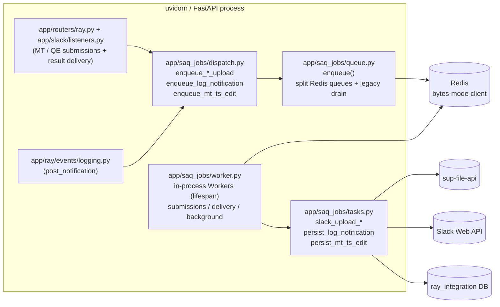

# SAQ Durable File Handling (RAY-79638)

This document describes how the Slack Ray Translator uses
[SAQ (Simple Async Queue)](https://github.com/tobymao/saq) to make Slack file
uploads and other side-effect background work durable, retryable, and
observable.

It supersedes the previous fire-and-forget pattern of wrapping
post-response work in `asyncio.create_task(...)`, which had three operational
problems:

1. The production failure that motivated this change —
  `SlackApiError: file_update_failed` raised by
   `client.files_completeUploadExternal(...)` inside the MT-success handler —
   was lost as soon as the orphaned task crashed, and the user never received
   their translated file.
2. Slack API blips, file-server timeouts, and Redis stalls produced no
  automatic retries.
3. The work happened inside the request-handling event loop, so abrupt pod
  restarts (rolling deployments, OOM kills) lost any in-flight uploads.

## Goals

- **Durability** — once an enqueue succeeds, the job survives a process
restart and is retried by the worker on resume.
- **Retries with backoff** — transient Slack/file-server errors are retried
automatically with exponential backoff before raising.
- **Idempotency** — every enqueue uses a stable key derived from the job
identifiers, so duplicate Ray events do not produce duplicate Slack
uploads.
- **No deployment changes** — the worker runs in-process inside the existing
uvicorn pod, using the existing Redis instance.
- **No tokens in the queue** — Slack bot tokens and file contents never
cross the queue boundary; tasks accept identifiers and re-fetch secrets at
runtime.

## Architecture




### Components


| File                          | Role                                                                                                                                                                                                                                                                                                                                       |
| ----------------------------- | ------------------------------------------------------------------------------------------------------------------------------------------------------------------------------------------------------------------------------------------------------------------------------------------------------------------------------------------ |
| `app/saq_jobs/_task_names.py` | Leaf module declaring the `TaskName = Literal[...]` type used by `enqueue(...)`. Contains no other imports so `queue.py` can depend on the type-checked task list without forming a circular import via `tasks.py`.                                                                                                                        |
| `app/saq_jobs/dispatch.py`    | Typed enqueue helpers — one function per durable side-effect. Owns idempotency keys, retry/timeout config, and payload construction. **All callers in routers and event handlers go through this module.**                                                                                                                                 |
| `app/saq_jobs/queue.py`       | Lazy singleton `RedisQueue`. Builds a dedicated bytes-mode Redis client (SAQ requires `decode_responses=False`) using the existing `straker_utils.redis.get_redis_auto` helper. Exposes the low-level `enqueue(...)` wrapper with structured logging; the `function` arg is typed as `TaskName` so pyright catches typos at the call site. |
| `app/saq_jobs/tasks.py`       | All durable task functions. Accepts only JSON-serialisable kwargs. Re-fetches `slack_user` (and the bot token) inside the task by `client_id`. Exposes `TASK_FUNCTIONS`, the worker registration list.                                                                                                                                     |
| `app/saq_jobs/worker.py`      | `start_worker` / `stop_worker` lifecycle helpers. Runs the SAQ `Worker` as an asyncio task in the FastAPI lifespan. Provides an out-of-process `settings` entry point as a future-proofing hook.                                                                                                                                           |
| `app/main.py`                 | Wires `start_worker()` and `stop_worker()` into the FastAPI lifespan context manager.                                                                                                                                                                                                                                                      |


### Worker liveness and hot reload recovery

Local development commonly runs `uvicorn --reload`. When WatchFiles reloads the
app while an SAQ task is active, the in-process worker can be cancelled during
shutdown and the durable job may remain in Redis until a healthy worker resumes.

To reduce manual restarts:

- `app/saq_jobs/worker.py` tracks each queue worker independently.
- `ensure_worker_running()` starts or restarts any enabled worker task that is
  missing, cancelled, or stopped unexpectedly.
- The low-level SAQ `enqueue()` boundary calls `ensure_worker_running()` before
  writing a job to Redis, so every producer can self-heal a partially stopped
  worker set without adding per-call wrapper functions.
- A compatibility worker also listens to the legacy `SAQ_QUEUE_NAME` queue so
  jobs created before the split queue rollout are drained after deploy/reload.
- `/health` reports SAQ worker state and returns `500` when
  `SAQ_WORKER_ENABLED=true` but not all expected queue workers are alive.

This recovery only applies while the FastAPI process itself is running. If the
process or container is stopped, no event handler is alive to restart workers;
the queued jobs remain durable in Redis and are picked up when the app starts.


### Package layering hygiene

`app/slack/__init__.py` and `app/ray/__init__.py` deliberately do **not**
re-export submodule symbols. Eager re-exports such as
`from .app import app` or `from .service import RayService, get_languages`
previously caused a hard-to-diagnose circular import: importing any
`app.slack.X` triggered the full Slack Bolt app load chain, which pulled
`app.slack.select_options` whose own `from ..ray import get_languages` then
hit a partially-initialised `app.ray` package and crashed.

Callers must import from explicit submodules:

```python
from app.slack.app import app
from app.slack.listeners import slack_handler
from app.ray.service import RayService, get_languages
```

This makes cold-importing any `app.saq_jobs.*`, `app.ray.events.*`, or
`app.slack.*` symbol from a fresh process work without warming up the rest
of the app first — useful for the future out-of-process SAQ worker entry
point and for one-off scripts.

### Type-checked task names

`app/saq_jobs/_task_names.py` declares `TaskName` as a `typing.Literal` of every
registered task name. The low-level `enqueue(function: TaskName, ...)` accepts
this type instead of a plain `str`, so pyright (and IDE autocomplete) flag
typos at the call site:

```python
await enqueue("slack_upload_mt_resul", ...)  # pyright error: not assignable to TaskName
```

The drift between `TaskName` and the actual `TASK_FUNCTIONS` registry list is
asserted in `tests/saq_jobs/test_task_registry.py` — adding a task to one
list without updating the other fails CI immediately.

### Layering rule

Routers and event handlers must never import from `app.saq_jobs.queue` or
construct SAQ payloads inline. They import the typed helpers from the
package root (e.g. `from app.saq_jobs import enqueue_mt_success_upload`).
This keeps queue-shaping logic — idempotency keys, retry budgets, payload
schemas — in one place so future task changes update both the producer and
the consumer atomically.

### Why a dedicated bytes-mode Redis client

The shared `app.redis` client is configured with `decode_responses=True` so
Python code reads strings instead of bytes. SAQ persists job payloads as
JSON-encoded bytes and explicitly requires a `Redis[bytes]` client. We
therefore call `get_redis_auto(decode_responses=False)` from the SAQ queue
factory, which still uses the same Redis host, port, password, and TLS
settings — the only difference is the response codec.

## Configuration

All values live in `app/config.py` and are documented in `.env.example`.


| Env var                                  | Default                                 | Purpose                                                                                   |
| ---------------------------------------- | --------------------------------------- | ----------------------------------------------------------------------------------------- |
| `SAQ_QUEUE_NAME`                         | `slack-ray-translator`                  | Legacy/default queue namespace used when no explicit queue is supplied.                   |
| `SAQ_WORKER_ENABLED`                     | `True`                                  | Set to `False` to disable in-process workers (e.g. when running dedicated worker pods).   |
| `SAQ_WORKER_CONCURRENCY`                 | `10`                                    | Legacy/default worker concurrency retained for compatibility.                             |
| `SAQ_FILE_SUBMISSION_QUEUE_NAME`         | `slack-ray-translator-file-submissions` | Low-concurrency queue for large or unknown-size Slack file submissions.                   |
| `SAQ_FILE_SUBMISSION_WORKER_CONCURRENCY` | `3`                                     | Low concurrency for large or unknown-size document MT and evaluation submission jobs.     |
| `SAQ_SMALL_FILE_SUBMISSION_QUEUE_NAME`   | `slack-ray-translator-small-file-submissions` | Higher-concurrency queue for known-small Slack file submissions.                   |
| `SAQ_SMALL_FILE_SUBMISSION_WORKER_CONCURRENCY` | `10`                              | Concurrency for known-small document MT and evaluation submission jobs.                   |
| `SAQ_LARGE_FILE_SUBMISSION_THRESHOLD_MB` | `10`                                    | Files at or above this size, or files with unknown Slack size metadata, use the low-concurrency submission queue. |
| `SAQ_SMALL_FILE_UPLOAD_TIMEOUT_SECONDS`  | `300`                                   | Per-attempt timeout for known-small submission jobs.                                       |
| `SAQ_FILE_DELIVERY_QUEUE_NAME`           | `slack-ray-translator-file-delivery`    | Queue for result delivery uploads back to Slack.                                          |
| `SAQ_FILE_DELIVERY_WORKER_CONCURRENCY`   | `10`                                    | Higher concurrency for user-visible completion delivery jobs.                             |
| `SAQ_BACKGROUND_QUEUE_NAME`              | `slack-ray-translator-background`       | Queue for lightweight persistence/cache jobs.                                             |
| `SAQ_BACKGROUND_WORKER_CONCURRENCY`      | `5`                                     | Concurrency for lightweight background jobs.                                              |
| `SAQ_FILE_UPLOAD_RETRIES`                | `5`                                     | Per-job retry budget for `slack_upload_*` tasks. SAQ uses jittered exponential backoff.   |
| `SAQ_FILE_UPLOAD_TIMEOUT_SECONDS`        | `900`                                   | Per-attempt timeout for large or unknown-size file-submission/upload tasks, sized for files up to 500 MB. |
| `SAQ_LOGGING_RETRIES`                    | `3`                                     | Per-job retry budget for `persist_log_notification` / `persist_mt_ts_edit`.               |
| `SAQ_LOGGING_TIMEOUT_SECONDS`            | `30`                                    | Per-attempt timeout for the logging tasks.                                                |


## Migrated background work

The following call sites have been moved from `asyncio.create_task(...)` to
SAQ enqueues. Each enqueue uses a deterministic idempotency key so re-played
Ray events do not produce duplicate Slack uploads.


| Trigger                                         | Previous implementation                                      | New SAQ task                     | Queue            | Idempotency key                                              |
| ----------------------------------------------- | ------------------------------------------------------------ | -------------------------------- | ---------------- | ------------------------------------------------------------ |
| Document MT modal submission                    | synchronous Slack download → file-server upload → MT publish | `process_document_mt_submission` | small-file-submissions or file-submissions | `process_document_mt_submission:{stable submission hash}`    |
| QE / human-translation modal submission         | synchronous Slack download → Verify/file-server upload       | `process_evaluation_submission`  | small-file-submissions or file-submissions | `process_evaluation_submission:{stable submission hash}`     |
| `verify:slack:document:translated` (MT success) | `_handle_mt_success_background`                              | `slack_upload_mt_result`         | file-delivery    | `mt_upload:{task_uuid}:{file_id}:{tl}:{thread_ts}`           |
| `verify:slack:transcribe:complete`              | `_handle_transcribe_success_background`                      | `slack_upload_transcription`     | file-delivery    | `transcribe_upload:{task_uuid}:{file_id}:{channel_id}`       |
| `verify:slack:evaluate:complete`                | `_handle_verify_complete_background`                         | `slack_upload_verify_complete`   | file-delivery    | `verify_upload:{grid_file_id}:{channel_id}`                  |
| `post_notification` DB write                    | `asyncio.create_task(log_notification(...))`                 | `persist_log_notification`       | background       | none (volume too high; SAQ retries cover transient DB blips) |
| `set_mt_ts_edit` Redis cache write              | `asyncio.create_task(set_mt_ts_edit(...))`                   | `persist_mt_ts_edit`             | background       | `mt_ts_edit:{client_id}:{ts}`                                |


### Scope rationale — `asyncio.create_task` calls left in place

Not every fire-and-forget call benefits from durability, and a few cannot
cleanly cross the queue boundary. Documented in
`app/saq_jobs/tasks.py` and repeated here so the decision is discoverable
from the docs:

- **In-process cache primers** — `files_list_simple` cache warming and
`_update_global_cache` in `app/slack/select_options.py`. These are
optimistic pre-fetches whose only purpose is to make the *next* request
faster. Queueing them adds latency without delivering durability that
matters: a dropped warm-up just causes the next request to refresh the
cache itself.
- `**slack_log_decorator` → `log_slack`** — the payload is a
`ray_logger.slack.SlackAppLog` object that is not JSON-serialisable through
SAQ. The existing `log_slack` helper already wraps the call in
`try/except`.
- `**RayService.api_ondemand_process`** — needs the request-scoped
authenticated `RayClient`. Reconstituting that auth inside the worker
would require persisting user tokens in Redis, violating the "no tokens
in queue payloads" rule that protects the durable store from token leaks.

## Idempotency, retries, and error semantics

- **Enqueue is fail-loud**. A Redis outage during enqueue raises immediately
to the caller (HTTP request handler) so the operator sees the outage
rather than silently losing durable work. The previous fire-and-forget
code would have swallowed the same outage.
- **Duplicate enqueue is a no-op**. SAQ returns `None` from `queue.enqueue`
when a job with the same key is already queued or in-flight; the
`app/saq_jobs/queue.py:enqueue` helper logs at INFO and returns.
- **Tasks re-raise on failure**. Every `slack_upload_*` task re-raises so
SAQ retries with jittered exponential backoff. Only on the *final* attempt
do we forward the exception to `notify_exception` (Google Chat / BugLog)
to avoid alert spam during transient Slack 5xx storms.
- **Temp file cleanup is in `finally`**. The downloaded file from
`sup-file-api` is removed even if Slack upload fails, so retries always
start with a clean slate.

## Logging and correlation

Every SAQ-related log line includes structured fields that allow grepping a
single job end-to-end:

- `function` — registered task name.
- `key` — idempotency key supplied by the caller.
- `job_key` — SAQ-assigned job key (used inside Redis).
- `attempts` — current retry count, useful for spotting hot retries.
- Task-specific identifiers: `task_uuid`, `file_id`, `channel_id`,
`grid_file_id`, `thread_ts`, `client_id`. Slack bot tokens, refresh
tokens, and downloaded file contents are **never** logged.

## Operational notes

- **Local dev** — run `pipenv run uvicorn app.main:app --reload`; the
worker starts inside the same process. Tail `Starting SAQ worker` /
`SAQ job enqueued` log lines.
- **Disabling the worker** — set `SAQ_WORKER_ENABLED=false` in any pod that
should accept HTTP traffic without consuming jobs (e.g. while migrating
to a dedicated worker deployment).
- **Out-of-process worker (future)** — `app/saq_jobs/worker.py` exposes a
`settings` dict suitable for `saq app.saq_jobs.worker.settings`. No code
changes are needed to run a sidecar worker; it is purely a deployment
decision.
- **Upgrading SAQ** — pinned to `saq[hiredis]==0.26.`* in `Pipfile`. Bump
the major version in a dedicated PR with an integration test pass.

## Tests


| Test file                              | Coverage                                                                                                                                                                          |
| -------------------------------------- | --------------------------------------------------------------------------------------------------------------------------------------------------------------------------------- |
| `tests/saq_jobs/test_queue.py`         | Low-level `enqueue` forwards function name, kwargs, key, retries, and timeout to SAQ; duplicate keys are silently no-op; Redis errors propagate.                                  |
| `tests/saq_jobs/test_tasks.py`         | Each task happy path (download → upload → cleanup), missing-slack-user branch, and final-retry `notify_exception` forwarding.                                                     |
| `tests/saq_jobs/test_dispatch.py`      | The typed `enqueue_`* helpers in `app.saq_jobs.dispatch` compute the documented idempotency keys and forward the configured retry / timeout values for every durable task.        |
| `tests/saq_jobs/test_task_registry.py` | Drift check between the `TaskName` Literal and `TASK_FUNCTIONS`; also asserts task names are unique.                                                                              |
| `tests/routers/test_ray.py`            | Existing router tests patch the typed helpers re-exported from `app.routers.ray` (`enqueue_mt_success_upload`, `enqueue_transcription_upload`, `enqueue_verify_complete_upload`). |


Run all SAQ-touching tests in isolation with:

```bash
pipenv run pytest tests/saq_jobs/ tests/routers/test_ray.py tests/ray/
```
