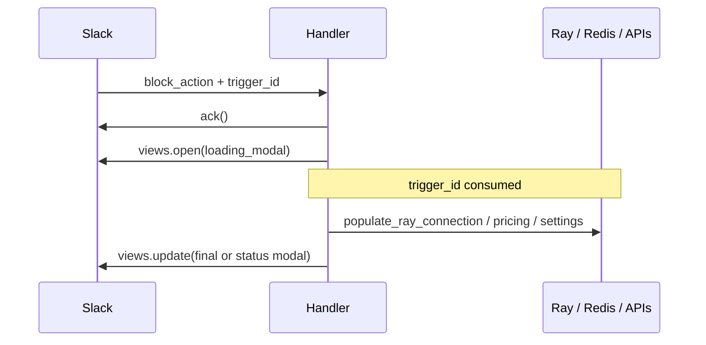

# Slack Modal Trigger Safety

Slack `trigger_id` values expire in a few seconds. Modal-open handlers must call
`views.open` before awaited Ray, Redis, settings, or Slack I/O.

## Standard pattern (RAY-72999)

Use the shared helpers in `app/slack/modal_trigger.py`:

1. `ack()`
2. `open_loading_modal(client, trigger_id)` — no awaited I/O before this
3. `populate_ray_connection(context)` when the handler skipped `ray_connection` middleware
4. Login / lock / pricing / settings work
5. `safe_views_update(...)` with the final modal, or `status_modal` / `request_error_modal`

## Handlers using this pattern

| Action | Handler |
|---|---|
| `evaluate_job` | HT / QE file modal |
| `document_mt_job` | Document MT modal (prod hot path) |
| `verify_job_modal_open` / `quote_summary_modal_open` | HT quote / Adjust Request |
| `job_search` | Job search modal |
| `settings_auto_translate` | Channel auto-translate settings (home tab) |
| `/ustraker translate` | Channel auto-translate settings (slash command; no `ray_connection` middleware) |
| `show_srt_translate_form` | SRT translate modal |
| `video_transcribe_translate` | Media T&T modal |
| `video_embed_subtitles` | Subtitle embed modal (when opening a modal) |

## Why middleware is skipped on these actions

`ray_connection` middleware performs Ray lookup + `users_info` before the
listener runs. That alone can burn the `trigger_id` TTL. Modal-open handlers
above omit that middleware and call `populate_ray_connection` **after**
`views.open`.

## Related

- Cursor rule: `.cursor/rules/slack-modal-trigger-safety.mdc`
- Original loading-modal work: RAY-72999
