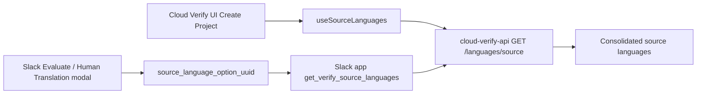

# Source Language Options

This document explains where source-language select options come from in Cloud Verify and how the Slack app now aligns with that behavior.

## Summary

- `cloud-verify-ui` Create Project uses `useSourceLanguages()` for the source-language select.
- `useSourceLanguages()` calls `cloud-verify-api` at `GET /languages/source`.
- `GET /languages/source` returns a consolidated source-language list, with one representative entry per language family.
- The Slack app source-language modal options now use the same Verify API endpoint, while target-language options continue to use the broader `GET /languages` list.

## Cloud Verify Flow

In `cloud-verify-ui`, the Create Project form pulls source-language options from the `sourceLanguageOptions` computed property, which is built from `useSourceLanguages()`.

That composable calls the Verify API:

- `GET /languages/source`

On the API side, `cloud-verify-api` resolves that route in `src/languages/router.py`, and `get_source_languages()` in `src/languages/service.py` consolidates regional variants into a single representative language where appropriate.

Examples of that behavior include:

- English variants being represented as a single English option
- Portuguese family selection preferring a single representative source option
- Cleaned labels that remove regional suffixes for source-language selection

## Slack App Alignment

Previously, the Slack source-language external select was backed by the same Verify language list used for target languages:

- `GET /languages`

That meant the source-language select could show a broader set of variants than Cloud Verify Create Project.

The Slack app now uses:

- `GET /languages/source` for source-language options
- `GET /languages` for target-language options

This keeps the Slack Evaluate and Human Translation modals aligned with Cloud Verify Create Project.

The Slack submit flow now also blocks same-family source and target combinations before submission, using the same family semantics as Cloud Verify. That means combinations like these are rejected inline in the modal:

- French -> French Canadian
- English -> English (UK)
- Portuguese -> Portuguese (Brazil)

## Data Flow Diagram

## Files Updated in Slack App

- `app/api/verify.py`
- `app/slack/select_options.py`
- `app/slack/listeners.py`
- `tests/slack/test_select_options.py`

## Notes

- No environment variables were added or changed.
- Source-language submission continues to send the selected Verify language UUID as `sl` when creating evaluation jobs.
- This change only affects which options are presented in the Slack source-language selector.
- Pre-submit validation now also prevents source and target languages from being the same language family, including regional variants.
