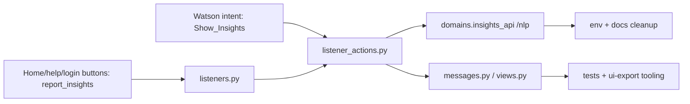

# Remove Deprecated Insights Feature — Implementation Plan

> **For agentic workers:** REQUIRED SUB-SKILL: Use `superpowers:subagent-driven-development` (recommended) or `superpowers:executing-plans` to implement this plan task-by-task. Steps use checkbox (`- [ ]`) syntax for tracking.

**Goal:** Remove the deprecated Insights feature from `slack-straker-translate` end-to-end — runtime entry points, Slack UI, config/env, tests, tooling, and docs — without breaking unrelated Slack flows.

**Architecture:** Insights enters the app via two paths: (1) Watson intent `Show_Insights` → `post_insights()` which POSTs to `domains.insights_api/nlp`, and (2) Slack button action `report_insights` → `post_report_insights()` which shows `ReportInsightsMessage`. Supporting code includes message classes, a plan-gating helper, home-tab / help / welcome / login buttons, env config, docs, tests, and UI-export tooling. Removal deletes both entry points and prunes all supporting code.

**Tech Stack:** Python, Slack Bolt, pytest, Pipenv, Ruff, mypy, Markdown docs.

**Branch:** `RAY-79162-Remove-deprecated-Insights-feature`

**Ticket:** [RAY-79162](https://app.clickup.com/t/36600298/RAY-79162)

---



## Files In Scope

| Action | File | What changes |
|--------|------|-------------|
| Modify | `app/slack/listener_actions.py` | Delete `case "Show_Insights"`, `post_insights()`, `post_report_insights()`; fix stale `ai_translate_help()` docstring; clean imports |
| Modify | `app/slack/listeners.py` | Delete `handle_report_insights_action`, `@app.action("report_insights")`, `post_report_insights` import |
| Modify | `app/slack/templates/messages.py` | Delete `InsightsMessage`, `ReportInsightsMessage`, `LoginMessage.INSIGHTS`, Insights buttons from `WelcomeBackMessage`, `SuccessfulLoginMessage`, `HelpMessage`; remove `is_min_langugagecloud_plan` import |
| Modify | `app/slack/templates/views.py` | Delete `report_insights` button from home tab |
| Modify | `app/ray/utils.py` | Delete `is_min_langugagecloud_plan()`; remove `Literal` from typing import (keep `Callable`, `Tuple`) |
| Modify | `.env.example` | Delete `INSIGHTS_API_DOMAIN=` |
| Modify | `tools/ui-export/generate_blocks.py` | Remove Insights imports, usages, sample blocks, and `is_min_langugagecloud_plan` patch |
| Modify | `tests/slack/test_listener_actions.py` | Delete `TestPostReportInsights`; remove `post_report_insights` import |
| Modify | `tests/slack/test_message_templates.py` | Add negative assertions for `report_insights` button absence |
| Modify | `docs/internal-services.md` | Remove Insights API section, mermaid node, env table row |
| Modify | `docs/ui-export.md` | Remove stale "insights" wording |
| Modify | `docs/changelog.md` | Add unreleased entry |

---

## Task 1: Remove Runtime Code, UI, Tests, and Commit

### Step 1: Delete runtime entry points in `listener_actions.py`

- [ ] Delete the `case "Show_Insights":` branch (lines ~591–599).
- [ ] Delete `post_insights()` (lines ~1597–1652).
- [ ] Delete `post_report_insights()` (lines ~1968–2004).
- [ ] Fix copy-paste docstring on `ai_translate_help()` (line ~2014): change `"""Show Insight message modal."""` to an accurate description like `"""Show AI Translate Help message."""`.
- [ ] Remove now-unused imports: `InsightsMessage`, `ReportInsightsMessage`. If `httpx` is no longer used elsewhere in this file, remove that import too (verify first).

> **Note:** No test existed for `post_insights()` (Watson path) — only `TestPostReportInsights` covered the button path. Both functions are being deleted entirely.

### Step 2: Delete Slack action registration in `listeners.py`

- [ ] Delete `handle_report_insights_action` function and its `@app.action("report_insights", ...)` decorator (line ~1144).
- [ ] Remove the `post_report_insights` import.

### Step 3: Delete Insights message classes and buttons in `messages.py`

- [ ] Delete `LoginMessage.INSIGHTS = "insights"` class variable (line ~145).
- [ ] Delete the `elif variation == self.INSIGHTS:` branch (lines ~187–188).
- [ ] Delete `InsightsMessage` class (lines ~1867–1886).
- [ ] Delete `ReportInsightsMessage` class (lines ~3055–3063).
- [ ] Remove `is_min_langugagecloud_plan` import (line ~49).
- [ ] Remove the `report_insights` button from **all three** classes that contain it:
  - `WelcomeBackMessage` (~line 440–456)
  - `SuccessfulLoginMessage` (~line 657–672)
  - `HelpMessage` (~line 2142–2154)

### Step 4: Delete Insights button from home view in `views.py`

- [ ] Remove the `report_insights` button block (lines ~403–412).

### Step 5: Delete `is_min_langugagecloud_plan()` from `utils.py`

- [ ] Delete the function (lines ~173–188+).
- [ ] Change typing import from `from typing import Callable, Literal, Tuple` to `from typing import Callable, Tuple` (only `Literal` is now unused; `Callable` and `Tuple` are still used by `VALID_FILE_TYPES` and `is_valid_file()`).

### Step 6: Update tests

- [ ] Delete `TestPostReportInsights` class from `tests/slack/test_listener_actions.py` (lines ~638–692).
- [ ] Remove the `post_report_insights` import (line ~20).
- [ ] In `tests/slack/test_message_templates.py`, add negative assertions to existing `TestHelpMessage`, `TestWelcomeBackMessage`, and `TestSuccessfulLoginMessage` tests confirming no block/button contains `action_id == "report_insights"`.

### Step 7: Run tests

- [ ] Run: `pipenv run pytest tests/slack/ -q`
- [ ] Expected: all pass, no import errors, no stale references.

### Step 8: Commit

```bash
git add -A
git commit -m "refactor: remove deprecated insights feature (RAY-79162)

- Delete post_insights(), post_report_insights(), Show_Insights case branch
- Delete InsightsMessage, ReportInsightsMessage, LoginMessage.INSIGHTS
- Remove report_insights buttons from home tab, help, welcome, login
- Delete is_min_langugagecloud_plan() helper (only used by insights)
- Fix copy-paste docstring on ai_translate_help()
- Remove TestPostReportInsights, add negative assertions for insights removal"
```

---

## Task 2: Remove Config, Tooling, and Documentation

### Step 1: Clean `.env.example`

- [ ] Delete `INSIGHTS_API_DOMAIN=` (line ~35).

### Step 2: Clean `tools/ui-export/generate_blocks.py`

- [ ] Remove imports of `InsightsMessage`, `ReportInsightsMessage`, `LoginMessage.INSIGHTS`.
- [ ] Remove `patch(f"{MSG}.is_min_langugagecloud_plan", return_value=True)` (line ~592).
- [ ] Remove catalog entries for `"InsightsMessage"` and `"ReportInsightsMessage"` (lines ~1250–1256).
- [ ] Remove any sample block containing `report_insights` or `:bar_chart: Insights` (lines ~1457–1459).

### Step 3: Update docs

- [ ] In `docs/internal-services.md`:
  - Remove the mermaid node `InsightsAPI["Insights API"]` and edge `App -->|HTTP| InsightsAPI`.
  - Delete section `### 5. Insights API (depricated)` (lines ~145–161).
  - Remove `INSIGHTS_API_DOMAIN` from the env summary table (line ~453).
- [ ] In `docs/ui-export.md`: remove "insights" wording from help row text (line ~101).
- [ ] In `docs/changelog.md`: add unreleased entry:
  `- [Removed]: Deprecated Insights feature fully removed — runtime, UI, config, tests, docs (username, 2026-03-26)`

### Step 4: Run tests and lint

- [ ] Run: `pipenv run pytest tests/slack/ -q`
- [ ] Run: `pipenv run ruff check app tests tools`
- [ ] Expected: all pass.

### Step 5: Commit

```bash
git add -A
git commit -m "docs: remove deprecated insights config, tooling, and documentation (RAY-79162)"
```

---

## Task 3: Full Verification and Dead-Code Sweep

### Step 1: Run full Slack test suite

- [ ] Run: `pipenv run pytest tests/slack/ -q`
- [ ] Expected: all pass.

### Step 2: Run static checks

- [ ] Run: `pipenv run ruff check app tests tools`
- [ ] Run: `pipenv run python -m mypy app/**/*.py`
- [ ] Expected: no new issues from deleted imports or dead branches.

### Step 3: Repo-wide grep for stale references

- [ ] Search terms: `Insights`, `report_insights`, `Show_Insights`, `INSIGHTS_API_DOMAIN`, `insights_api`, `InsightsMessage`, `ReportInsightsMessage`, `is_min_langugagecloud_plan`, `send_insights_message`, `_insights_request`
- [ ] Expected: zero matches in product code. Only pre-existing historical changelog entries may mention "Insights."
- [ ] If any stale references found, fix and amend last commit.

### Step 4: Final commit (if needed)

```bash
git add -A
git commit -m "chore: final dead-code sweep for insights removal (RAY-79162)"
```

---

## Out-of-Repo Follow-Up Checklist

- [ ] Remove or reroute the Watson Assistant `Show_Insights` intent in external assistant configuration.
- [ ] Remove `INSIGHTS_API_DOMAIN` from deployment env/secrets across all environments.
- [ ] If `straker_utils.domain.StrakerDomains` still defines an `insights_api` attribute, file a follow-up to clean it from the shared library.
- [ ] If Slack app metadata registers `report_insights` separately from code, remove that registration.

## Tech Debt Notes

- `app/slack/templates/messages.py` is ~3986 lines, far exceeding the 200–300 line guideline. This removal trims ~60 lines. Consider a follow-up ticket to refactor this file.

---

## Verification Commands Summary

```bash
pipenv run pytest tests/slack/ -q
pipenv run ruff check app tests tools
pipenv run python -m mypy app/**/*.py
```
