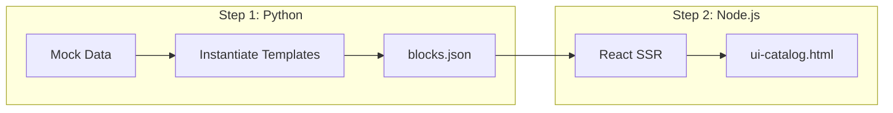

# Slack UI Export Tool

A dev tool that renders all Slack Block Kit templates into a single self-contained HTML file for visual review.

## Overview

The UI export tool generates a browsable catalog of every Slack message and modal template in the app, rendered with realistic mock data using the `slack-blocks-to-jsx` React library. This is useful for:

- Reviewing all UI templates in one place without needing Slack
- Sharing template designs with stakeholders
- Catching visual regressions after template changes
- Documenting the full set of user-facing messages

## Architecture



1. **Python** (`generate_blocks.py`) - Instantiates all message classes and view functions with mock data, exports Block Kit JSON
2. **Node.js** (`render.mjs`) - Reads the JSON, renders each template via React SSR using `slack-blocks-to-jsx`, outputs a styled HTML page

## Prerequisites

- Python 3.12+ with the project virtual environment (`.venv`)
- Node.js 18+ (used for the React SSR rendering step)

## Usage

```bash
cd tools/ui-export

# Full pipeline: generate JSON, render HTML, open in browser
make

# Individual steps
make generate   # Python: create output/blocks.json
make render     # Node.js: create output/ui-catalog.html
make open       # Open the HTML file in browser
make clean      # Remove generated files

# First time only (or after package.json changes)
make install    # npm install
```

## Output

- `output/blocks.json` - Raw Block Kit JSON for all templates with metadata
- `output/ui-catalog.html` - Self-contained HTML file (~430KB) with all templates rendered

The HTML file includes:

- Navigation sidebar with all categories and templates
- 110+ templates across 13 categories (Auth, Jobs, Quotes, Events, etc.)
- Modal views rendered with chrome (title bar, submit button)
- Text-only messages displayed with a styled block

## File Structure

```text
tools/ui-export/
  generate_blocks.py   # Python: mock data + template instantiation
  render.mjs           # Node.js: React SSR rendering
  package.json         # Node dependencies
  Makefile             # Build automation
  .gitignore           # Excludes node_modules/ and output/
  output/              # Generated files (git-ignored)
    blocks.json
    ui-catalog.html
```

## Adding New Templates

When a new message class or view function is added to the app:

1. Add mock data and instantiation in `generate_blocks.py` inside `build_all_messages()` or `build_all_views()`
2. Run `make` to regenerate

## Template Categories

| Category    | Count | Description                              |
|-------------|-------|------------------------------------------|
| Auth        | 20    | Login, logout, onboarding, permissions   |
| Home        | 2     | App home tab views                       |
| Jobs        | 21    | Job status, lists, creation, files       |
| Quotes      | 6     | Quote creation, acceptance, cancellation |
| Events      | 8     | Signup, approval, status change events   |
| Translation | 7     | Auto-translate, MT results, settings     |
| Video       | 5     | Transcription, subtitle options          |
| Quality     | 4     | Evaluation results, verify complete      |
| FactCheck   | 2     | Claim extraction results                 |
| Modals      | 19    | All modal dialogs                        |
| Help        | 4     | Help messages, AI helper                 |
| Tokens      | 3     | Token purchase prompts                   |
| Errors      | 7     | Error and warning messages               |
