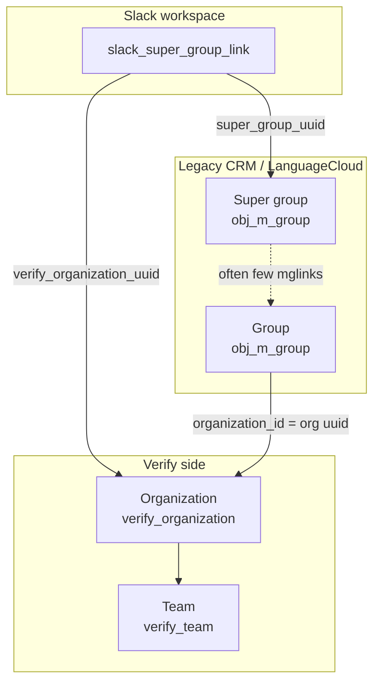

# Verify org/team vs legacy CRM super group/group

Concise map of the two hierarchies Slack Ray Translator straddles when resolving billing, login, and Admin/Owner quote gates.



## Side-by-side

| | Verify | Legacy CRM |
|---|---|---|
| Parent | **Organization** | **Super group** |
| Child | **Team** | **Group** |
| Tables | `verify_organization` → `verify_team` | `obj_m_group` (super) → `obj_m_group` (children) |
| Link parent→child | `verify_team.organization_uuid` | Child `obj_m_group.organization_id` = Verify org uuid |
| Roles | `verify_team_user_link.user_role` | `obj_m_mglink.client_type` (`Owner` / `Admin` / `Normal` / …) |

They are **analogous**, not the same records: org/team is the Verify product model; super group/group is the older LC/CRM model. Slack holds both IDs on `slack_super_group_link`.

## Normal relationship in this app

1. A Slack workspace is linked to one CRM **super group** and one Verify **organization**.
2. Customer work happens on CRM **groups** whose `organization_id` matches that Verify org (e.g. “IBM Slack App”).
3. The super group row is often a thin shell — **members and Admin/Owner rows usually sit on the child groups**.
4. Org-billed flows (Document MT without member login) bill the Verify **organization** uuid.
5. Member-gated flows (HT/QE, quote Accept for admins) need an LC **member**, with Admin/Owner judged in the **workspace org** (super group or any child group under that org).

## Role overlap

| Expectation | Reality |
|---|---|
| Verify team admin ⇒ CRM Admin | Not automatic; separate role tables |
| CRM Admin on primary group ⇒ quotes in this Slack workspace | Only if that group (or another Admin group) is under the **workspace** Verify org |
| Super-group Admin is how customers are set up | Uncommon; check child groups under `organization_id` |
| “Group” in conversation | Ask: Verify **team** or CRM **group**? |

## Practical checks

```sql
-- Child groups + admins under a workspace Verify org
SELECT g.label, link.client_type, m.email_primary
FROM sitemanager.obj_m_mglink link
JOIN sitemanager.obj_m_group g ON g.obj_uuid = link.groupid
JOIN sitemanager.obj_m_member m ON m.obj_uuid = link.memberid
WHERE g.organization_id = :verify_organization_uuid
  AND link.client_type IN ('Admin', 'Owner');
```

Code entry points: `get_ray_super_group`, `RaySuperGroup.verify_organization_uuid`, `user_may_receive_quotes` / `member_is_admin_in_organization`.
