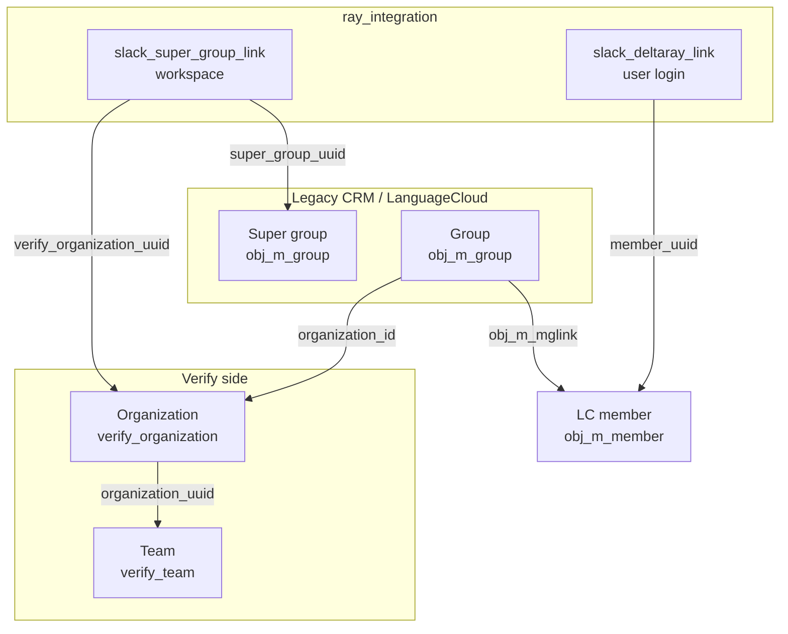

# Verify org/team vs legacy CRM super group/group

Concise map of the two hierarchies Slack Ray Translator straddles when resolving billing, login, and Admin/Owner quote gates.



## Side-by-side

| | Verify | Legacy CRM |
|---|---|---|
| Parent | **Organization** | **Super group** |
| Child | **Team** | **Group** |
| Tables | `verify_organization` → `verify_team` | `obj_m_group` (super) / `obj_m_group` (children) |
| Link parent→child | `verify_team.organization_uuid` | Child `organization_id` = Verify org uuid |
| Roles | `verify_team_user_link.user_role` | `obj_m_mglink.client_type` |

They are **analogous**, not the same records.

## Relations (detail)

### Verify team → organization

- `verify_team.organization_uuid` points at `verify_organization.obj_uuid`.
- One org has many teams; team membership/roles live on `verify_team_user_link`.

### Organization → CRM group

- CRM groups hang under the Verify org via `obj_m_group.organization_id` = org uuid.
- This is on the CRM group row (not a column on `verify_organization`).
- Example: “IBM Slack App” group → org “IBM Slack App”.

### CRM group → super group

- **No direct parent/child FK** between group and super group on `obj_m_group`.
- They meet through the Verify org on the Slack workspace link:
  - `group.organization_id` = `slack_super_group_link.verify_organization_uuid`
  - that row’s `super_group_uuid` is the workspace super group
- Super group rows are often flagged `is_super_group` and frequently have `organization_id` NULL.
- Real LC members/admins usually sit on **child groups**, not the super group.

## Slack link tables

### `slack_deltaray_link` — member login (not org, not Verify team)

| Column | Meaning |
|--------|---------|
| `member_uuid` | LC member (`obj_m_member.obj_uuid`) — **this is the link target** |
| `slack_user_id` | Slack user |
| `slack_team_id` / `slack_enterprise_id` | Slack **workspace** (not Verify team) |

- Unique on `member_uuid` (one deltaray row per member).
- Does **not** store `verify_organization_uuid`, Verify team uuid, or CRM group/super group.
- Org/team/group context is resolved separately (mglink, primary `groupid`, or workspace `slack_super_group_link`).

### `slack_super_group_link` — workspace (org + super group)

| Column | Meaning |
|--------|---------|
| `super_group_uuid` | CRM super group |
| `verify_organization_uuid` | Verify organization |
| `slack_team_id` / `slack_enterprise_id` | Slack workspace |

One row ties the workspace to **both** the CRM super group and the Verify org.

## Role overlap

| Expectation | Reality |
|---|---|
| Verify team admin ⇒ CRM Admin | Not automatic; separate role tables |
| CRM Admin on primary group ⇒ quotes in this Slack workspace | Only if under the **workspace** Verify org |
| Super-group Admin is how customers are set up | Uncommon; check child groups under `organization_id` |
| Deltaray link implies org membership | No — only Slack user ↔ member |
| “Team” in conversation | Ask: Slack workspace team id, Verify **team**, or CRM **group**? |

## Practical checks

```sql
-- Workspace: org + super group
SELECT super_group_uuid, verify_organization_uuid, slack_team_id
FROM ray_integration.slack_super_group_link
WHERE is_active = 1 AND slack_team_id = :slack_team_id;

-- Member login (deltaray) — no org/team columns
SELECT member_uuid, slack_user_id, slack_team_id
FROM ray_integration.slack_deltaray_link
WHERE is_active = 1 AND slack_user_id = :slack_user_id;

-- Child-group admins under a workspace Verify org
SELECT g.label, link.client_type, m.email_primary
FROM sitemanager.obj_m_mglink link
JOIN sitemanager.obj_m_group g ON g.obj_uuid = link.groupid
JOIN sitemanager.obj_m_member m ON m.obj_uuid = link.memberid
WHERE g.organization_id = :verify_organization_uuid
  AND link.client_type IN ('Admin', 'Owner');
```

Code entry points: `get_ray_client` / `slack_deltaray_link`, `get_ray_super_group` / `slack_super_group_link`, `user_may_receive_quotes` / `member_is_admin_in_organization`.
