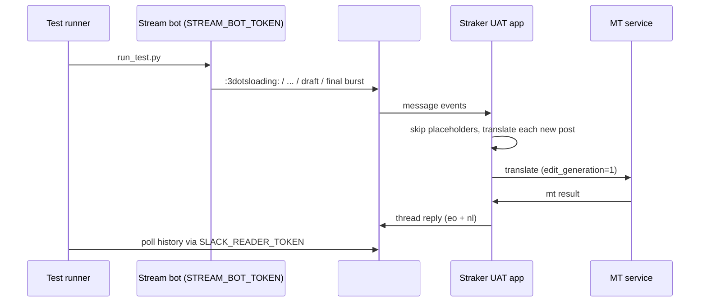

# Bot channel auto-translation — UAT test runner (RAY-80512)

Manual test tool for verifying placeholder skipping, per-message translation, and edit
delivery against the UAT Slack workspace.

## Channel discovered in UAT MySQL

Queried via `mysql-op uat-portal ray_integration` on 2026-07-02:

| Field | Value |
|-------|-------|
| Channel | `#test2332` |
| `channel_id` | `C09MMR2ETMZ` |
| `slack_team_id` | `T04D0JGE2HH` |
| `slack_enterprise_id` | `E04RDMG8XP1` |
| Auto-translate format | `thread` |
| Target languages | `eo`, `nl` |
| Straker bot user | `U03U9RB1F0B` (`B059H33GQA1`) |

Reload live values any time:

```bash
cd tools/bot-translation-uat-test
make lookup
# or
pipenv run python run_test.py --lookup-only
```

## Prerequisites

1. **UAT deployment** includes the RAY-80512 changes (placeholder guard, edit generation, sync reply cache).
2. **SAQ worker running** on UAT pods (for other background jobs; bot post translation is immediate).
3. **A separate Slack bot** added to `#test2332` with `chat:write` (and ideally `channels:history` / `groups:history` for verification).

> **Important:** do **not** use the Straker app bot token. `message_event` skips auto-translate when the poster is the app's own `bot_user_id` (`U03U9RB1F0B`). The stream bot must be a different installed bot.

4. **`mysql-op`** available locally if you want live DB lookup (`make lookup`).

## Environment variables

| Variable | Required | Description |
|----------|----------|-------------|
| `STREAM_BOT_TOKEN` | No* | `xoxb-…` token for a non-Straker bot in `#test2332` |
| `SLACK_READER_TOKEN` | No | Token used to read channel/thread history (defaults to `STREAM_BOT_TOKEN`) |
| `BOT_TRANSLATION_TEST_STREAM_BOT_USER_ID` | No | Local MySQL bot to load (default `U05G5Q168CX` / `straker_translate_wad`) |
| `BOT_TRANSLATION_TEST_WAIT_SECONDS` | No | Max wait for MT result per message (default `45`) |
| `BOT_TRANSLATION_TEST_MYSQL_ALIAS` | No | `mysql-op` alias for channel lookup (default `uat-portal`) |

\*When unset, the runner loads a token automatically from **local Percona** via the repo
``.env`` DB settings (`DB_HOST_ray_integration=localhost`, table
``ray_integration.slack_bots``). It picks the configured stream bot
(``U05G5Q168CX`` by default), which is **not** the Straker app bot
(``U03U9RB1F0B``). Pass ``--no-local-token`` to disable this fallback.

## Test flow



## Scenarios

| Scenario | What it posts | Expected |
|----------|---------------|----------|
| `placeholders` | `:3dotsloading:`, `...`, `…` each alone | **No** Straker translation reply |
| `burst` | Placeholders (skipped) + draft + final as **separate posts** | **Draft and final** each get a thread translation |
| `edit` | Final message → wait → `chat.update` | Same reply updated in place (not a duplicate channel message) |
| `threaded-stream` | User question at root → bot `:3dotsloading:` + AskTECHNO progress block **in thread**, then the progress frame is **deleted** (post→delete→repost) | **Passes** only when delivery anchors on the thread root ts (not the bot reply ts) **and** the deleted frame produces no orphaned translation (deletion tombstone) |

## Commands

```bash
cd tools/bot-translation-uat-test

# Inspect DB config
make lookup

# See planned steps without posting
make dry-run

# Individual scenarios (token auto-loaded from local MySQL when unset)
make placeholders
make burst WAIT_SECONDS=60
make edit
make threaded-stream WAIT_SECONDS=60

# Full sequence — stream bot token auto-loaded from local MySQL (U05G5Q168CX)
make all WAIT_SECONDS=60
```

## Manual verification checklist

While/after the script runs, confirm in Slack `#test2332`:

- [ ] Placeholder posts (`:3dotsloading:`, `…`) never get a Straker reply
- [ ] Burst produces a thread translation under **both** draft and final bot messages
- [ ] Translation is a **thread reply**, not a new top-level channel message
- [ ] After `edit`, the existing translation updates instead of duplicating
- [ ] `threaded-stream`: no orphaned translation is posted for the deleted streaming frame (not in-thread, not at channel root)

Optional deeper checks:

- **Redis (UAT):** `channel_mt_gen:<source_ts>` increments on each edit of the same message
- **Audit DB:** recent rows in `ray_integration_log.slack_logs` for `channel_id = C09MMR2ETMZ` (can be slow — use `LIMIT`)

## Troubleshooting

| Symptom | Likely cause |
|---------|----------------|
| No translation at all | Inactive super-group link, missing MT tokens, or stream bot is Straker itself |
| Translation on placeholder | UAT not deployed with RAY-80512 placeholder guard |
| Multiple translations after burst | Expected when draft and final are separate messages (one translation per post) |
| New message instead of thread update on edit | `mt_ts` cache miss / stale generation discard mis-config |
| Translation at channel root with thread display | Wrong `thread_ts` in `post_channel_translation_notification`; must anchor on the thread root (`thread_ts or message_ts`), not the bot reply ts; caught by `threaded-stream` delivery check |
| Orphaned translation of a deleted streaming frame | Deletion tombstone (`channel_mt_deleted:{ts}`) not written on `message_deleted`/`tombstone` or not checked in the MT callback; caught by `threaded-stream` |
